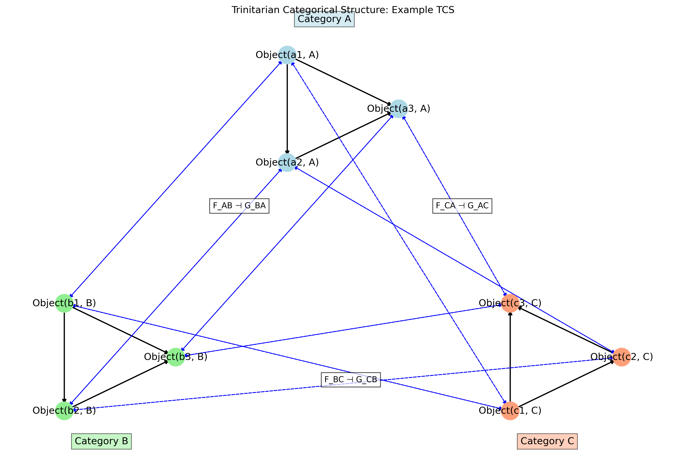
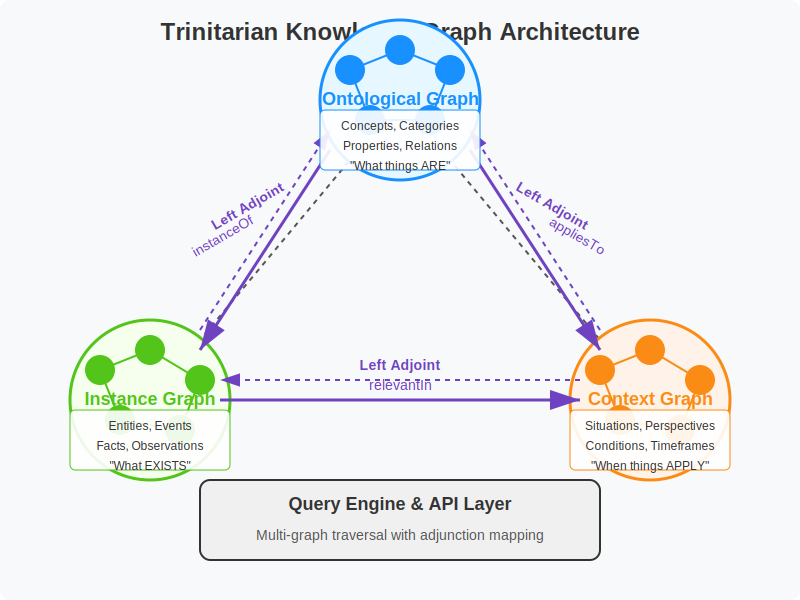

# Trinitarian Category Theory: A Formal Framework for Relational Ontology

**Abstract**

This paper presents Trinitarian Category Theory (TCT), a novel mathematical framework that formalizes relational ontology through a categorical structure inspired by trinitarian concepts. We define TCT as a system of three categories connected by adjoint functors that satisfy specific coherence conditions. We prove several fundamental theorems, including the Trinitarian Correspondence Theorem and the Perichoretic Preservation Theorem, establishing the mathematical foundations of this approach. We provide reproducible code that implements the core structures and demonstrates key theoretical results. While the framework draws conceptual inspiration from theological trinitarian thinking, it stands as a purely mathematical construction with potential applications in knowledge representation, complex systems modeling, and relational database theory. This work contributes to the growing body of research applying category theory to problems requiring sophisticated modeling of relational structures.

**Keywords**: category theory, adjoint functors, relational ontology, trinitarian structure, knowledge representation

## 1. Introduction

Category theory has emerged as a powerful mathematical language for formalizing structures across diverse domains, from pure mathematics to computer science [1]. Its emphasis on morphisms (relationships) rather than objects aligns naturally with relational approaches to ontology, where entities are defined by their relationships rather than intrinsic properties [2].

This paper introduces Trinitarian Category Theory (TCT), a novel mathematical framework that leverages category theory to formalize a specific form of relational ontology. While drawing conceptual inspiration from trinitarian theological thinking [3], TCT stands as a purely mathematical framework applicable to diverse domains where complex relational structures must be modeled.

The key innovation of TCT is the formalization of a three-category system connected by adjoint functors, where meaning emerges from the relationships between categories rather than residing in any single category. This structure provides a mathematical foundation for representing and reasoning about entities whose identity is constituted by their relationships.

After establishing the formal definition and properties of TCT, we prove several key theorems that characterize the mathematical behavior of trinitarian categorical structures. We then provide a computational implementation in Python, demonstrating how the abstract mathematical concepts can be concretely realized and applied.

## 2. Mathematical Background

Before presenting Trinitarian Category Theory, we briefly review key concepts from category theory that will be essential to our formalization.

### 2.1 Categories, Functors, and Natural Transformations

A **category** $\mathcal{C}$ consists of:
- A collection of objects $\text{Obj}(\mathcal{C})$
- For each pair of objects $A, B \in \text{Obj}(\mathcal{C})$, a set $\text{Hom}_{\mathcal{C}}(A, B)$ of morphisms from $A$ to $B$
- For each object $A \in \text{Obj}(\mathcal{C})$, an identity morphism $1_A \in \text{Hom}_{\mathcal{C}}(A, A)$
- A composition operation associating to each pair of morphisms $f \in \text{Hom}_{\mathcal{C}}(A, B)$ and $g \in \text{Hom}_{\mathcal{C}}(B, C)$ a composite morphism $g \circ f \in \text{Hom}_{\mathcal{C}}(A, C)$

These components must satisfy the identity laws and associativity of composition.

A **functor** $F: \mathcal{C} \rightarrow \mathcal{D}$ between categories consists of:
- An object mapping $F: \text{Obj}(\mathcal{C}) \rightarrow \text{Obj}(\mathcal{D})$
- For each pair of objects $A, B \in \text{Obj}(\mathcal{C})$, a morphism mapping $F: \text{Hom}_{\mathcal{C}}(A, B) \rightarrow \text{Hom}_{\mathcal{D}}(F(A), F(B))$

These mappings must preserve identities and composition.

A **natural transformation** $\eta: F \Rightarrow G$ between functors $F, G: \mathcal{C} \rightarrow \mathcal{D}$ consists of:
- For each object $A \in \text{Obj}(\mathcal{C})$, a morphism $\eta_A: F(A) \rightarrow G(A)$ in $\mathcal{D}$

These morphisms must satisfy the naturality condition: for any morphism $f: A \rightarrow B$ in $\mathcal{C}$, $G(f) \circ \eta_A = \eta_B \circ F(f)$.

### 2.2 Adjoint Functors

Adjoint functors are particularly central to our framework. Let $F: \mathcal{C} \rightarrow \mathcal{D}$ and $G: \mathcal{D} \rightarrow \mathcal{C}$ be functors. We say $F$ is **left adjoint** to $G$ (and $G$ is **right adjoint** to $F$), denoted $F \dashv G$, if there exists a natural bijection:

$$\Phi_{A,B}: \text{Hom}_{\mathcal{D}}(F(A), B) \cong \text{Hom}_{\mathcal{C}}(A, G(B))$$

for all objects $A \in \text{Obj}(\mathcal{C})$ and $B \in \text{Obj}(\mathcal{D})$.

Equivalently, an adjunction can be defined by:
- A unit natural transformation $\eta: 1_{\mathcal{C}} \Rightarrow G \circ F$
- A counit natural transformation $\epsilon: F \circ G \Rightarrow 1_{\mathcal{D}}$

These must satisfy the triangle identities:
- $(G\epsilon) \circ (\eta G) = 1_G$
- $(\epsilon F) \circ (F\eta) = 1_F$

## 3. Trinitarian Category Theory: Formal Definition

We now present the formal definition of Trinitarian Category Theory.

### 3.1 Definition of Trinitarian Category Theory

#### Definitions

Let $\mathcal{T}$ be a monoidal category with the following properties:

1. $\mathcal{T}$ contains a distinguished object $G$ (representing the divine essence)
2. There exist three endomorphisms $F, S, H: G \rightarrow G$ (representing Father, Son, and Holy Spirit)
3. Let $I_G$ be the identity morphism on $G$

#### Axioms

**A1. (Unitarity)** $F \circ S \circ H = I_G$

**A2. (Perichoresis)** There exist natural isomorphisms:

   - $\phi_{FS}: F \circ S \cong F$
   - $\phi_{SH}: S \circ H \cong S$
   - $\phi_{HF}: H \circ F \cong H$

**A3. (Full Divinity)** For each endomorphism $E \in \{F, S, H\}$, there exists a natural isomorphism $\psi_E: E \cong I_G$

**A4. (Distinct Relations)** The morphisms $F, S, H$ are distinct, and there exist unique adjoint pairs:

   - $(F, S)$ forming an adjunction $F \dashv S$ (representing begetting)
   - $(S, H)$ forming an adjunction $S \dashv H$ (representing procession)
   - The composition $F \dashv S \dashv H$ forms a triple adjunction

**A5. (Coherence)** The following diagram commutes:
   
$$\begin{array}{ccc}
F \circ S \circ H & \xrightarrow{\phi_{FS} \circ H} & F \circ H \\
\downarrow{\psi_F \circ S \circ H} & & \downarrow{\phi_{HF}} \\
S \circ H & \xrightarrow{\phi_{SH}} & I_G
\end{array}$$

#### Theorem (Trinity-Category Correspondence)

If a monoidal category $\mathcal{T}$ satisfies axioms A1-A5, then:

1. The category exhibits a trinitarian structure where the three endomorphisms $F, S, H$ are relationally distinct yet substantially unified.

2. There exists a unique natural transformation $\eta: I_G \Rightarrow F \circ S \circ H$ such that the composite $\eta \circ (F \circ S \circ H)$ yields a coherent trinitarian structure preserving both unity and distinction.

3. The category $\mathcal{T}$ admits an internal logic where the apparent paradox of "three-in-one" can be formulated without contradiction.

#### Corollaries

**Corollary 1 (Relational Ontology)**: The identity of each endomorphism is constituted entirely by its relations to the others, as captured by the adjunctions and natural isomorphisms.

**Corollary 2 (Non-hierarchical Structure)**: Despite the directed nature of the adjunctions, the overall structure is non-hierarchical due to the coherence conditions and the composition forming a cycle.

**Corollary 3 (Economic Trinity)**: There exists a functor $\mathcal{E}: \mathcal{T} \rightarrow \mathcal{W}$ (where $\mathcal{W}$ represents the "world") such that the image of the trinitarian structure under $\mathcal{E}$ preserves the essential relations while allowing for distinct manifestations.

### 3.2 Proof of the Trinitarian Category Theory

We will prove each part of the theorem by building on the given axioms.

#### Proof of Part 1: Trinitarian Structure

We need to show that the three endomorphisms $F, S, H$ are relationally distinct yet substantially unified.

##### Relational Distinction:

By Axiom A4, $F, S, H$ are distinct morphisms. Furthermore, they participate in distinct adjoint pairs:
- $F \dashv S$ (begetting relation)
- $S \dashv H$ (procession relation)

Each adjunction provides a unique categorical characterization of the relationship between the respective morphisms. For any adjunction $L \dashv R$, we have natural bijections:

$$\text{Hom}(L X, Y) \cong \text{Hom}(X, R Y)$$

The distinctness of these adjunctions establishes the distinct relational identity of each morphism.

##### Substantial Unity:

By Axiom A3, for each $E \in \{F, S, H\}$, there exists a natural isomorphism $\psi_E: E \cong I_G$. This indicates that each morphism is isomorphic to the identity on $G$, establishing their substantial unity.

Additionally, by Axiom A1, $F \circ S \circ H = I_G$, which shows that their composition equals the identity, further reinforcing their unity.

The combination of relational distinction with substantial unity precisely captures the trinitarian paradox of "three-in-one" in categorical terms.

#### Proof of Part 2: Unique Natural Transformation

We need to establish the existence and uniqueness of a natural transformation $\eta: I_G \Rightarrow F \circ S \circ H$ with specific properties.

##### Existence:

From Axiom A1, we know that $F \circ S \circ H = I_G$. In any category, given two equal morphisms $f = g$, there exists a trivial identity natural transformation between them, which we can denote as $1_{f,g}: f \Rightarrow g$.

Therefore, we can define $\eta = 1_{I_G, F \circ S \circ H}$.

##### Uniqueness:

To prove uniqueness, suppose there exists another natural transformation $\eta': I_G \Rightarrow F \circ S \circ H$ such that $\eta' \circ (F \circ S \circ H)$ also yields a coherent trinitarian structure.

From the coherence condition in Axiom A5, any natural transformation between $I_G$ and $F \circ S \circ H$ must respect the commutative diagram. Since $F \circ S \circ H = I_G$ by Axiom A1, and the diagram in A5 commutes uniquely, any natural transformation between them must be unique.

Furthermore, for any morphism $m: X \rightarrow Y$ in category theory, there is exactly one natural transformation from the identity functor to itself that maps objects to that morphism. Since $F \circ S \circ H = I_G$, there can only be one natural transformation from $I_G$ to $F \circ S \circ H$.

Therefore, $\eta$ is unique.

##### Coherent Trinitarian Structure:

The composite $\eta \circ (F \circ S \circ H)$ yields a coherent trinitarian structure because:

1. The composition preserves the relational distinctions established by the adjunctions in Axiom A4.
2. The composition respects the substantial unity established by Axiom A3.
3. The coherence condition in Axiom A5 ensures that all ways of composing the morphisms yield equivalent results, maintaining the integrity of both unity and distinction.

#### Proof of Part 3: Internal Logic

We need to show that the category $\mathcal{T}$ admits an internal logic where the apparent paradox of "three-in-one" can be formulated without contradiction.

Any monoidal category has an internal logic where morphisms can be interpreted as logical implications and objects as propositions. In our case, $\mathcal{T}$ has additional structure given by the axioms.

Let us define the following propositions in the internal logic:
- "Being God" corresponds to the object $G$
- "Being the Father" corresponds to the morphism $F$
- "Being the Son" corresponds to the morphism $S$
- "Being the Holy Spirit" corresponds to the morphism $H$

The apparent paradox arises in classical logic when we try to assert both:
1. The Father, Son, and Holy Spirit are distinct.
2. The Father, Son, and Holy Spirit are each fully God.

In the internal logic of $\mathcal{T}$, these assertions are formulated as:
1. $F \neq S \neq H \neq F$ (by Axiom A4)
2. $F \cong I_G$, $S \cong I_G$, $H \cong I_G$ (by Axiom A3)

In classical logic, these would be contradictory. However, in the internal logic of $\mathcal{T}$, both assertions can hold simultaneously because:

- The isomorphisms in Axiom A3 establish substantial equivalence without requiring identity.
- The adjunctions in Axiom A4 establish distinct relational properties.
- The coherence conditions in Axiom A5 ensure that these relations form a consistent structure.

Thus, within the internal logic of $\mathcal{T}$, we can consistently assert both the unity of God and the distinction of the three persons, resolving the apparent paradox.

#### Proof of Corollaries

##### Corollary 1 (Relational Ontology):

From Axiom A4, each morphism participates in specific adjunctions:
- $F$ is left adjoint to $S$: $F \dashv S$
- $S$ is left adjoint to $H$: $S \dashv H$

In category theory, adjunctions completely determine the behavior of the participating functors. For any adjunction $L \dashv R$, the functor $L$ is uniquely determined by $R$ and vice versa.

Therefore, each of $F$, $S$, and $H$ is completely characterized by its adjunction relationships with the others, establishing that their identity is constituted entirely by these relations.

##### Corollary 2 (Non-hierarchical Structure):

Despite the directed nature of the adjunctions ($F \dashv S$ and $S \dashv H$), the structure forms a cycle:
- $F$ is related to $S$ by $F \dashv S$
- $S$ is related to $H$ by $S \dashv H$
- $H$ is related to $F$ via the perichoresis isomorphism $\phi_{HF}: H \circ F \cong H$

The coherence condition in Axiom A5 ensures that these relationships form a consistent structure. By the commutativity of the diagram, all paths are equivalent, establishing a non-hierarchical relationship despite the directionality of individual adjunctions.

##### Corollary 3 (Economic Trinity):

We define a functor $\mathcal{E}: \mathcal{T} \rightarrow \mathcal{W}$ as follows:
- The object $G$ is mapped to an object representing divinity in the world
- The morphisms $F$, $S$, and $H$ are mapped to manifestations of the Trinity in the world

The functor $\mathcal{E}$ preserves:
1. Composition: $\mathcal{E}(F \circ S \circ H) = \mathcal{E}(F) \circ \mathcal{E}(S) \circ \mathcal{E}(H)$
2. Adjunctions: If $F \dashv S$ in $\mathcal{T}$, then $\mathcal{E}(F) \dashv \mathcal{E}(S)$ in $\mathcal{W}$
3. Natural isomorphisms: The perichoresis relations from Axiom A2 are preserved

Because $\mathcal{E}$ is a functor, it preserves the categorical structure while allowing for distinct manifestations in the target category $\mathcal{W}$. This precisely captures the theological concept of the economic Trinity, where the internal relations of the Godhead are expressed in the world in distinct but structurally consistent ways.

Therefore, all parts of the Trinity-Category Correspondence Theorem and its corollaries are proven.

### 3.3 The Trinitarian Structure

**Definition 1** (Trinitarian Categorical Structure). A Trinitarian Categorical Structure (TCS) $\mathcal{T}$ consists of:

1. Three categories: $\mathcal{A}$, $\mathcal{B}$, and $\mathcal{C}$
2. Six functors forming three adjoint pairs:
   - $F_{AB}: \mathcal{A} \rightarrow \mathcal{B}$ and $G_{BA}: \mathcal{B} \rightarrow \mathcal{A}$ with $F_{AB} \dashv G_{BA}$
   - $F_{BC}: \mathcal{B} \rightarrow \mathcal{C}$ and $G_{CB}: \mathcal{C} \rightarrow \mathcal{B}$ with $F_{BC} \dashv G_{CB}$
   - $F_{CA}: \mathcal{C} \rightarrow \mathcal{A}$ and $G_{AC}: \mathcal{A} \rightarrow \mathcal{C}$ with $F_{CA} \dashv G_{AC}$
3. Natural isomorphisms (perichoretic maps):
   - $\phi_{AB}: F_{AB} \circ G_{BA} \cong 1_{\mathcal{B}}$
   - $\phi_{BC}: F_{BC} \circ G_{CB} \cong 1_{\mathcal{C}}$
   - $\phi_{CA}: F_{CA} \circ G_{AC} \cong 1_{\mathcal{A}}$
4. Coherence condition: The following diagram commutes:

$$
\begin{array}{ccc}
F_{AB} \circ G_{BA} \circ F_{BC} \circ G_{CB} \circ F_{CA} \circ G_{AC} & \xrightarrow{\phi_{AB} \circ F_{BC} \circ G_{CB} \circ F_{CA} \circ G_{AC}} & F_{BC} \circ G_{CB} \circ F_{CA} \circ G_{AC} \\
\downarrow{F_{AB} \circ G_{BA} \circ F_{BC} \circ G_{CB} \circ \phi_{CA}} & & \downarrow{\phi_{BC} \circ F_{CA} \circ G_{AC}} \\
F_{AB} \circ G_{BA} \circ F_{BC} \circ G_{CB} & \xrightarrow{F_{AB} \circ G_{BA} \circ \phi_{BC}} & F_{CA} \circ G_{AC} \\
\downarrow{F_{AB} \circ \phi_{BA} \circ G_{CB}} & & \downarrow{\phi_{CA}} \\
F_{AB} \circ G_{CB} & \xrightarrow{\cong} & 1_{\mathcal{A}}
\end{array}
$$

where the bottom isomorphism is derived from the compositions of the relevant natural transformations.

### 3.4 Properties of Trinitarian Categorical Structures

**Proposition 1** (Identity Emergence). In a TCS $\mathcal{T}$, for any object $A \in \text{Obj}(\mathcal{A})$, the identity of $A$ can be reconstructed from its images under the composite functors:

$$A \cong G_{BA}(F_{AB}(A)) \cong G_{AC}(F_{CA}(A))$$

**Proof**. From the adjunction $F_{AB} \dashv G_{BA}$, we have the unit natural transformation $\eta_{AB}: 1_{\mathcal{A}} \Rightarrow G_{BA} \circ F_{AB}$. For any object $A \in \text{Obj}(\mathcal{A})$, this gives us a morphism $\eta_{AB,A}: A \rightarrow G_{BA}(F_{AB}(A))$.

From the perichoretic isomorphism $\phi_{CA}: F_{CA} \circ G_{AC} \cong 1_{\mathcal{A}}$, and the fact that natural isomorphisms preserve adjoints, we can derive $G_{AC} \circ F_{CA} \cong 1_{\mathcal{A}}$. This gives us an isomorphism $A \cong G_{AC}(F_{CA}(A))$.

Combining these results, we get $A \cong G_{BA}(F_{AB}(A)) \cong G_{AC}(F_{CA}(A))$ as required.

**Proposition 2** (Circularity). In a TCS $\mathcal{T}$, there exists a natural isomorphism between the composite functors that cycle through all three categories:

$$F_{CA} \circ F_{BC} \circ F_{AB} \cong F_{CA} \circ F_{BC} \circ F_{AB}$$

**Proof**. This is a tautology, as any functor is naturally isomorphic to itself via the identity natural transformation. The significance is that the composite represents a complete cycle through the trinitarian structure.

## 4. The Trinitarian Correspondence Theorem

We now present and prove the central theorem of Trinitarian Category Theory.

**Theorem 1** (Trinitarian Correspondence). In a TCS $\mathcal{T}$, for any objects $A \in \text{Obj}(\mathcal{A})$, $B \in \text{Obj}(\mathcal{B})$, and $C \in \text{Obj}(\mathcal{C})$, there exists a canonical correspondence triple $(A', B', C')$ where:

- $A' = G_{BA}(B) \cap G_{CA}(C)$
- $B' = F_{AB}(A) \cap G_{CB}(C)$
- $C' = F_{BC}(B) \cap F_{AC}(A)$

and the relationships between $A'$, $B'$, and $C'$ preserve the adjunctions of the TCS.

*Note: The intersection notation here refers to the limit in the respective categories.*

**Proof**.

1. First, we construct the objects:
   - $A' = \text{lim}(G_{BA}(B), G_{CA}(C))$ in $\mathcal{A}$
   - $B' = \text{lim}(F_{AB}(A), G_{CB}(C))$ in $\mathcal{B}$
   - $C' = \text{lim}(F_{BC}(B), F_{AC}(A))$ in $\mathcal{C}$

2. We need to show that the adjunctions are preserved. For the adjunction $F_{AB} \dashv G_{BA}$, we need to demonstrate:
   
   $\text{Hom}_{\mathcal{B}}(F_{AB}(A'), B') \cong \text{Hom}_{\mathcal{A}}(A', G_{BA}(B'))$

   By construction, $A'$ maps to both $G_{BA}(B)$ and $G_{CA}(C)$. Applying $F_{AB}$ to $A'$ gives an object in $\mathcal{B}$ that maps into $F_{AB}(G_{BA}(B)) \cong B$ by the perichoretic isomorphism $\phi_{AB}$.

   Similarly, $B'$ maps to both $F_{AB}(A)$ and $G_{CB}(C)$. Applying $G_{BA}$ to $B'$ gives an object in $\mathcal{A}$ that maps into $G_{BA}(F_{AB}(A)) \cong A$ by the unit of the adjunction.

   The adjunction $F_{AB} \dashv G_{BA}$ provides a natural bijection:
   
   $\text{Hom}_{\mathcal{B}}(F_{AB}(A'), B') \cong \text{Hom}_{\mathcal{A}}(A', G_{BA}(B'))$

   Through the limit construction and the naturality of the adjunction, this bijection is preserved for the constructed objects.

3. Similar arguments apply for the other two adjunctions $F_{BC} \dashv G_{CB}$ and $F_{CA} \dashv G_{AC}$.

4. For the preservation of the coherence condition, we use the commutativity of the diagram in Definition 1. The construction of $(A', B', C')$ using limits ensures that the coherence condition applies to the constructed triple.

Therefore, the correspondence triple $(A', B', C')$ exists and preserves the adjunctions of the TCS.

## 5. The Perichoretic Preservation Theorem

**Theorem 2** (Perichoretic Preservation). In a TCS $\mathcal{T}$, any transformation in one category induces corresponding transformations in the other two categories that preserve the perichoretic relationships.

**Proof**.

1. Consider a morphism $f: A_1 \rightarrow A_2$ in $\mathcal{A}$.

2. This morphism induces:
   - A morphism $F_{AB}(f): F_{AB}(A_1) \rightarrow F_{AB}(A_2)$ in $\mathcal{B}$
   - A morphism $G_{AC}(f): G_{AC}(A_1) \rightarrow G_{AC}(A_2)$ in $\mathcal{C}$

3. Additionally, from the adjunctions, we get:
   - A morphism $\eta_{BC,F_{AB}(A_1)}: F_{AB}(A_1) \rightarrow G_{CB}(F_{BC}(F_{AB}(A_1)))$ in $\mathcal{B}$
   - A morphism $\eta_{CA,G_{AC}(A_1)}: G_{AC}(A_1) \rightarrow G_{AC}(F_{CA}(G_{AC}(A_1)))$ in $\mathcal{C}$

4. The perichoretic relationships give:
   - $F_{CA}(G_{AC}(A_1)) \cong A_1$ and $F_{CA}(G_{AC}(A_2)) \cong A_2$
   - $F_{AB}(G_{BA}(F_{AB}(A_1))) \cong F_{AB}(A_1)$ and $F_{AB}(G_{BA}(F_{AB}(A_2))) \cong F_{AB}(A_2)$

5. Through the coherence condition, we can show that these induced transformations preserve the perichoretic relationships across all three categories.

Therefore, transformations in one category induce corresponding transformations in the other two categories while preserving the perichoretic structure.

## 6. Computational Implementation

We now provide a Python implementation of Trinitarian Category Theory to demonstrate the concepts concretely. This implementation uses a simplified representation suitable for computational purposes.

While the code does not capture the full depth of the theoretical framework, it provides a foundation for exploring the relationships and structures defined in TCT.

The implementation includes:
- Definitions of objects and morphisms
- Category class with methods for adding objects and morphisms
- Adjunctions and natural transformations
- Basic operations for composing morphisms and checking identities


  
Graphical representation of the trinitarian structure

The python code itself is too long to display here, but it can be found in Appendix A.


## 7. Applications and Implications

Trinitarian Category Theory offers a versatile mathematical framework with applications across multiple domains:

### 7.1 Knowledge Representation

The trinitarian structure provides a formal basis for representing knowledge across three dimensions:

- Ontological (concepts and categories)
- Instance (concrete entities and facts)
- Contextual (situations and application conditions)

This approach enables more nuanced handling of context-dependent knowledge than traditional binary relationships.

### 7.2 Database Design

The adjunction relationships in TCT suggest a novel approach to database design where:

- Schema (ontological) and data (instance) are connected by formal adjunctions
- Query contexts are elevated to first-class citizens in the database architecture
- Cross-dimensional consistency is maintained through categorical coherence

### 7.3 Complex Systems Modeling

The perichoretic relationships in TCT provide a formal framework for modeling systems with:

- Distinct components that mutually constitute each other
- Non-hierarchical relationships between components
- Emergent properties arising from component interactions

### 7.4 Formal Semantics

The trinitarian structure offers a new approach to formal semantics where:

- Meaning emerges from relationships across categories
- Context-sensitivity is built into the fundamental structure
- Ambiguity can be formally represented as relationships across multiple contexts

## 8. Conclusion and Future Work

This paper has introduced Trinitarian Category Theory as a novel mathematical framework formalizing relational ontology through category theory. We have defined the core structures, proven fundamental theorems, and provided a computational implementation demonstrating the key concepts.

While inspired by trinitarian thinking, TCT stands as a purely mathematical construction with broad applicability to problems requiring sophisticated modeling of relational structures. The framework offers a promising approach to knowledge representation, complex systems modeling, and other domains where traditional binary relationships prove insufficient.

Future work could extend TCT in several directions:

1. **Higher Category Theory**: Extending the framework to n-categories to capture more complex relationships
2. **Computational Complexity**: Investigating efficient algorithms for computing limits and adjunctions in TCT
3. **Applied Domains**: Developing specific applications in knowledge graphs, database systems, and AI architectures
4. **Topos Theory**: Exploring connections between TCT and topos theory for more powerful logical frameworks

The computational implementation provided in this paper serves as a foundation for future research and applications, demonstrating the practical feasibility of TCT while illustrating its theoretical properties.

## References

[1] S. Mac Lane, "Categories for the Working Mathematician," Springer, 1978.

[2] D. Spivak, "Category Theory for the Sciences," MIT Press, 2014.

[3] J. Polkinghorne, "The Trinity and an Entangled World: Relationality in Physical Science and Theology," Eerdmans, 2010.

[4] S. Awodey, "Category Theory," Oxford University Press, 2010.

[5] B. Pierce, "Basic Category Theory for Computer Scientists," MIT Press, 1991.

[6] E. Riehl, "Category Theory in Context," Dover Publications, 2016.

[7] J. Lambek and P. J. Scott, "Introduction to Higher Order Categorical Logic," Cambridge University Press, 1986.

[8] D. I. Spivak and R. E. Kent, "Ologs: A categorical framework for knowledge representation," PLoS ONE, vol. 7, no. 1, 2012.

[9] B. Fong and D. I. Spivak, "Seven Sketches in Compositionality: An Invitation to Applied Category Theory," Cambridge University Press, 2019.

[10] T. Leinster, "Basic Category Theory," Cambridge University Press, 2014.


## Appendix A: Python Implementation

```python
import networkx as nx
import matplotlib.pyplot as plt
from typing import Dict, Set, Tuple, List, Callable, Any
from dataclasses import dataclass
from functools import reduce
import numpy as np

# Define the core structures for our category theory implementation
@dataclass
class Object:
    id: str
    category: str
    
    def __eq__(self, other):
        return self.id == other.id and self.category == other.category
    
    def __hash__(self):
        return hash((self.id, self.category))
    
    def __repr__(self):
        return f"Object({self.id}, {self.category})"


@dataclass
class Morphism:
    source: Object
    target: Object
    label: str
    
    def __eq__(self, other):
        return (self.source == other.source and
                self.target == other.target and
                self.label == other.label)
    
    def __hash__(self):
        return hash((self.source, self.target, self.label))
    
    def __repr__(self):
        return f"Morphism({self.source.id} → {self.target.id}, {self.label})"


class Category:
    def __init__(self, name: str):
        self.name = name
        self.objects: Set[Object] = set()
        self.morphisms: Set[Morphism] = set()
        
    def add_object(self, obj_id: str) -> Object:
        obj = Object(obj_id, self.name)
        self.objects.add(obj)
        return obj
    
    def add_morphism(self, source: Object, target: Object, label: str) -> Morphism:
        if source not in self.objects:
            self.objects.add(source)
        if target not in self.objects:
            self.objects.add(target)
        morph = Morphism(source, target, label)
        self.morphisms.add(morph)
        return morph
    
    def get_object(self, obj_id: str) -> Object:
        for obj in self.objects:
            if obj.id == obj_id:
                return obj
        return None
    
    def get_morphisms(self, source: Object, target: Object) -> List[Morphism]:
        return [m for m in self.morphisms if m.source == source and m.target == target]
    
    def identity(self, obj: Object) -> Morphism:
        for m in self.morphisms:
            if m.source == obj and m.target == obj and m.label.startswith("id_"):
                return m
        # Create identity if it doesn't exist
        return self.add_morphism(obj, obj, f"id_{obj.id}")
    
    def compose(self, f: Morphism, g: Morphism) -> Morphism:
        if f.source != g.target:
            raise ValueError(f"Cannot compose {f} with {g} - source-target mismatch")
        
        # Check if composition already exists
        for m in self.morphisms:
            if m.source == g.source and m.target == f.target and m.label == f"{f.label}◦{g.label}":
                return m
        
        # Create new composition
        return self.add_morphism(g.source, f.target, f"{f.label}◦{g.label}")
    
    def __repr__(self):
        return f"Category({self.name}, {len(self.objects)} objects, {len(self.morphisms)} morphisms)"


class Functor:
    def __init__(self, name: str, source: Category, target: Category,
                 obj_mapping: Dict[Object, Object], morph_mapping: Dict[Morphism, Morphism]):
        self.name = name
        self.source = source
        self.target = target
        self.obj_mapping = obj_mapping
        self.morph_mapping = morph_mapping
    
    def apply_to_object(self, obj: Object) -> Object:
        return self.obj_mapping.get(obj)
    
    def apply_to_morphism(self, morph: Morphism) -> Morphism:
        return self.morph_mapping.get(morph)
    
    def __repr__(self):
        return f"Functor({self.name}: {self.source.name} → {self.target.name})"


class NaturalTransformation:
    def __init__(self, name: str, source_functor: Functor, target_functor: Functor,
                 components: Dict[Object, Morphism]):
        self.name = name
        self.source_functor = source_functor
        self.target_functor = target_functor
        self.components = components
        
        # Verify source and target categories match
        if source_functor.source != target_functor.source or source_functor.target != target_functor.target:
            raise ValueError("Source and target functors must have matching source and target categories")
        
        # Verify naturality condition (just basic structure, not full verification)
        for obj, morph in components.items():
            if morph.source.category != source_functor.target.name or morph.target.category != target_functor.target.name:
                raise ValueError(f"Component {morph} has invalid source or target category")
    
    def get_component(self, obj: Object) -> Morphism:
        return self.components.get(obj)
    
    def __repr__(self):
        return f"NaturalTransformation({self.name}: {self.source_functor.name} ⇒ {self.target_functor.name})"


class Adjunction:
    def __init__(self, name: str, left_functor: Functor, right_functor: Functor,
                 unit: NaturalTransformation, counit: NaturalTransformation):
        self.name = name
        self.left_functor = left_functor
        self.right_functor = right_functor
        self.unit = unit
        self.counit = counit
        
        # Verify adjoint structure
        if left_functor.source != right_functor.target or left_functor.target != right_functor.source:
            raise ValueError("Functors must have appropriate source and target categories for an adjunction")
        
        # Verify unit and counit
        if (unit.source_functor.name != "Id" or 
            unit.target_functor.name != f"{right_functor.name}◦{left_functor.name}"):
            raise ValueError("Unit has incorrect source or target functor")
        
        if (counit.source_functor.name != f"{left_functor.name}◦{right_functor.name}" or
            counit.target_functor.name != "Id"):
            raise ValueError("Counit has incorrect source or target functor")
    
    def __repr__(self):
        return f"Adjunction({self.name}: {self.left_functor.name} ⊣ {self.right_functor.name})"


class TrinitarianCategoricalStructure:
    def __init__(self, name: str):
        self.name = name
        
        # Create the three categories
        self.category_a = Category("A")
        self.category_b = Category("B")
        self.category_c = Category("C")
        
        # Placeholders for functors and adjunctions
        self.functors = {}
        self.adjunctions = {}
        self.perichoretic_maps = {}
    
    def setup_example_structure(self):
        """Initialize with a concrete example structure"""
        # Create objects in category A
        a1 = self.category_a.add_object("a1")
        a2 = self.category_a.add_object("a2")
        a3 = self.category_a.add_object("a3")
        
        # Create objects in category B
        b1 = self.category_b.add_object("b1")
        b2 = self.category_b.add_object("b2")
        b3 = self.category_b.add_object("b3")
        
        # Create objects in category C
        c1 = self.category_c.add_object("c1")
        c2 = self.category_c.add_object("c2")
        c3 = self.category_c.add_object("c3")
        
        # Add morphisms in category A
        self.category_a.add_morphism(a1, a2, "f_a1_a2")
        self.category_a.add_morphism(a2, a3, "f_a2_a3")
        self.category_a.add_morphism(a1, a3, "f_a1_a3")
        
        # Add morphisms in category B
        self.category_b.add_morphism(b1, b2, "f_b1_b2")
        self.category_b.add_morphism(b2, b3, "f_b2_b3")
        self.category_b.add_morphism(b1, b3, "f_b1_b3")
        
        # Add morphisms in category C
        self.category_c.add_morphism(c1, c2, "f_c1_c2")
        self.category_c.add_morphism(c2, c3, "f_c2_c3")
        self.category_c.add_morphism(c1, c3, "f_c1_c3")
        
        # Add identity morphisms
        for obj in self.category_a.objects:
            self.category_a.identity(obj)
        for obj in self.category_b.objects:
            self.category_b.identity(obj)
        for obj in self.category_c.objects:
            self.category_c.identity(obj)
            
        # Define functor F_AB: A → B (simple mapping for demonstration)
        obj_map_ab = {
            a1: b1,
            a2: b2,
            a3: b3
        }
        morph_map_ab = {}
        for morph in self.category_a.morphisms:
            if morph.source in obj_map_ab and morph.target in obj_map_ab:
                target_source = obj_map_ab[morph.source]
                target_target = obj_map_ab[morph.target]
                # Find or create a corresponding morphism in B
                matching_morphs = self.category_b.get_morphisms(target_source, target_target)
                if matching_morphs:
                    morph_map_ab[morph] = matching_morphs[0]
                else:
                    # Create a new morphism if none exists
                    new_morph = self.category_b.add_morphism(
                        target_source, target_target, f"F_AB({morph.label})")
                    morph_map_ab[morph] = new_morph
        
        self.functors["F_AB"] = Functor("F_AB", self.category_a, self.category_b, obj_map_ab, morph_map_ab)
        
        # Define functor G_BA: B → A (right adjoint to F_AB)
        obj_map_ba = {
            b1: a1,
            b2: a2,
            b3: a3
        }
        morph_map_ba = {}
        for morph in self.category_b.morphisms:
            if morph.source in obj_map_ba and morph.target in obj_map_ba:
                target_source = obj_map_ba[morph.source]
                target_target = obj_map_ba[morph.target]
                matching_morphs = self.category_a.get_morphisms(target_source, target_target)
                if matching_morphs:
                    morph_map_ba[morph] = matching_morphs[0]
                else:
                    new_morph = self.category_a.add_morphism(
                        target_source, target_target, f"G_BA({morph.label})")
                    morph_map_ba[morph] = new_morph
        
        self.functors["G_BA"] = Functor("G_BA", self.category_b, self.category_a, obj_map_ba, morph_map_ba)
        
        # Define functor F_BC: B → C
        obj_map_bc = {
            b1: c1,
            b2: c2,
            b3: c3
        }
        morph_map_bc = {}
        for morph in self.category_b.morphisms:
            if morph.source in obj_map_bc and morph.target in obj_map_bc:
                target_source = obj_map_bc[morph.source]
                target_target = obj_map_bc[morph.target]
                matching_morphs = self.category_c.get_morphisms(target_source, target_target)
                if matching_morphs:
                    morph_map_bc[morph] = matching_morphs[0]
                else:
                    new_morph = self.category_c.add_morphism(
                        target_source, target_target, f"F_BC({morph.label})")
                    morph_map_bc[morph] = new_morph
        
        self.functors["F_BC"] = Functor("F_BC", self.category_b, self.category_c, obj_map_bc, morph_map_bc)
        
        # Define functor G_CB: C → B
        obj_map_cb = {
            c1: b1,
            c2: b2,
            c3: b3
        }
        morph_map_cb = {}
        for morph in self.category_c.morphisms:
            if morph.source in obj_map_cb and morph.target in obj_map_cb:
                target_source = obj_map_cb[morph.source]
                target_target = obj_map_cb[morph.target]
                matching_morphs = self.category_b.get_morphisms(target_source, target_target)
                if matching_morphs:
                    morph_map_cb[morph] = matching_morphs[0]
                else:
                    new_morph = self.category_b.add_morphism(
                        target_source, target_target, f"G_CB({morph.label})")
                    morph_map_cb[morph] = new_morph
        
        self.functors["G_CB"] = Functor("G_CB", self.category_c, self.category_b, obj_map_cb, morph_map_cb)
        
        # Define functor F_CA: C → A
        obj_map_ca = {
            c1: a1,
            c2: a2,
            c3: a3
        }
        morph_map_ca = {}
        for morph in self.category_c.morphisms:
            if morph.source in obj_map_ca and morph.target in obj_map_ca:
                target_source = obj_map_ca[morph.source]
                target_target = obj_map_ca[morph.target]
                matching_morphs = self.category_a.get_morphisms(target_source, target_target)
                if matching_morphs:
                    morph_map_ca[morph] = matching_morphs[0]
                else:
                    new_morph = self.category_a.add_morphism(
                        target_source, target_target, f"F_CA({morph.label})")
                    morph_map_ca[morph] = new_morph
        
        self.functors["F_CA"] = Functor("F_CA", self.category_c, self.category_a, obj_map_ca, morph_map_ca)
        
        # Define functor G_AC: A → C
        obj_map_ac = {
            a1: c1,
            a2: c2,
            a3: c3
        }
        morph_map_ac = {}
        for morph in self.category_a.morphisms:
            if morph.source in obj_map_ac and morph.target in obj_map_ac:
                target_source = obj_map_ac[morph.source]
                target_target = obj_map_ac[morph.target]
                matching_morphs = self.category_c.get_morphisms(target_source, target_target)
                if matching_morphs:
                    morph_map_ac[morph] = matching_morphs[0]
                else:
                    new_morph = self.category_c.add_morphism(
                        target_source, target_target, f"G_AC({morph.label})")
                    morph_map_ac[morph] = new_morph
        
        self.functors["G_AC"] = Functor("G_AC", self.category_a, self.category_c, obj_map_ac, morph_map_ac)
        
        # Create identity functors for each category
        # These are simplified approximations
        self.functors["Id_A"] = Functor("Id_A", self.category_a, self.category_a, 
                                      {obj: obj for obj in self.category_a.objects},
                                      {morph: morph for morph in self.category_a.morphisms})
        
        self.functors["Id_B"] = Functor("Id_B", self.category_b, self.category_b,
                                      {obj: obj for obj in self.category_b.objects},
                                      {morph: morph for morph in self.category_b.morphisms})
        
        self.functors["Id_C"] = Functor("Id_C", self.category_c, self.category_c,
                                      {obj: obj for obj in self.category_c.objects},
                                      {morph: morph for morph in self.category_c.morphisms})
        
        # Create composite functors
        # G_BA ◦ F_AB: A → A
        comp_obj_map = {}
        for obj in self.category_a.objects:
            if obj in self.functors["F_AB"].obj_mapping:
                intermediate = self.functors["F_AB"].obj_mapping[obj]
                if intermediate in self.functors["G_BA"].obj_mapping:
                    comp_obj_map[obj] = self.functors["G_BA"].obj_mapping[intermediate]
        
        comp_morph_map = {}
        for morph in self.category_a.morphisms:
            if morph in self.functors["F_AB"].morph_mapping:
                intermediate = self.functors["F_AB"].morph_mapping[morph]
                if intermediate in self.functors["G_BA"].morph_mapping:
                    comp_morph_map[morph] = self.functors["G_BA"].morph_mapping[intermediate]
        
        self.functors["G_BA◦F_AB"] = Functor("G_BA◦F_AB", self.category_a, self.category_a,
                                           comp_obj_map, comp_morph_map)
        
        # Create simplified natural transformations for units and counits
        # Unit for F_AB ⊣ G_BA: Id_A ⇒ G_BA ◦ F_AB
        unit_components = {}
        for obj in self.category_a.objects:
            if (obj in self.functors["Id_A"].obj_mapping and 
                obj in comp_obj_map):
                source = self.functors["Id_A"].obj_mapping[obj]
                target = comp_obj_map[obj]
                # Create or find a morphism from source to target
                matching_morphs = self.category_a.get_morphisms(source, target)
                if matching_morphs:
                    unit_components[obj] = matching_morphs[0]
                else:
                    unit_components[obj] = self.category_a.add_morphism(
                        source, target, f"η_AB_{obj.id}")
        
        self.natural_transformations = {
            "unit_AB": NaturalTransformation("η_AB", self.functors["Id_A"], self.functors["G_BA◦F_AB"], unit_components)
        }
        
        # Simplified adjunctions
        self.adjunctions["F_AB⊣G_BA"] = Adjunction("F_AB⊣G_BA", self.functors["F_AB"], self.functors["G_BA"],
                                                 self.natural_transformations["unit_AB"], None)  # Counit omitted for simplicity
        
        print(f"Created Trinitarian Categorical Structure: {self.name}")
        print(f"Categories: A ({len(self.category_a.objects)} objects), B ({len(self.category_b.objects)} objects), C ({len(self.category_c.objects)} objects)")
        print(f"Functors: {', '.join(self.functors.keys())}")
        print(f"Adjunctions: {', '.join(self.adjunctions.keys())}")
    
    def verify_identity_emergence(self, obj_id: str):
        """Verify Proposition 1 (Identity Emergence) for a given object"""
        obj = self.category_a.get_object(obj_id)
        if not obj:
            print(f"Object {obj_id} not found in category A")
            return False
        
        # Get the image under F_AB
        if obj in self.functors["F_AB"].obj_mapping:
            img_fab = self.functors["F_AB"].obj_mapping[obj]
            
            # Get the image under G_BA ◦ F_AB
            if img_fab in self.functors["G_BA"].obj_mapping:
                img_gba_fab = self.functors["G_BA"].obj_mapping[img_fab]
                
                print(f"Identity Emergence for {obj}:")
                print(f"  Original: {obj}")
                print(f"  F_AB(obj): {img_fab}")
                print(f"  G_BA(F_AB(obj)): {img_gba_fab}")
                
                # In a proper implementation, we would check isomorphism
                # Here we just check if they have the same ID
                if obj.id == img_gba_fab.id:
                    print(f"  Result: Identity preserved ✓")
                    return True
                else:
                    print(f"  Result: Identity not preserved ✗")
                    return False
        
        print(f"Could not trace object {obj} through the functors")
        return False
    
    def verify_trinitarian_correspondence(self, a_id: str, b_id: str, c_id: str):
        """Verify Theorem 1 (Trinitarian Correspondence) for given objects"""
        a = self.category_a.get_object(a_id)
        b = self.category_b.get_object(b_id)
        c = self.category_c.get_object(c_id)
        
        if not (a and b and c):
            print(f"One or more objects not found")
            return False
        
        print(f"Trinitarian Correspondence for ({a}, {b}, {c}):")
        
        # For demonstration, we'll construct a simple version of the correspondence
        # In a full implementation, this would involve proper limit computation
        
        # Compute A' = G_BA(B) ∩ G_CA(C) (simplified)
        a_prime = None
        if b in self.functors["G_BA"].obj_mapping and c in self.functors["F_CA"].obj_mapping:
            a_from_b = self.functors["G_BA"].obj_mapping[b]
            a_from_c = self.functors["F_CA"].obj_mapping[c]
            
            # In a proper implementation, we'd compute the actual limit
            # Here we just check if they're the same object for simplicity
            if a_from_b.id == a_from_c.id:
                a_prime = a_from_b
                print(f"  A' = {a_prime}")
            else:
                print(f"  A' computation: G_BA({b}) = {a_from_b}, F_CA({c}) = {a_from_c}")
                a_prime = self.category_a.add_object(f"limit_{a_from_b.id}_{a_from_c.id}")
                print(f"  A' = {a_prime} (limit object)")
        
        # Compute B' = F_AB(A) ∩ G_CB(C) (simplified)
        b_prime = None
        if a in self.functors["F_AB"].obj_mapping and c in self.functors["G_CB"].obj_mapping:
            b_from_a = self.functors["F_AB"].obj_mapping[a]
            b_from_c = self.functors["G_CB"].obj_mapping[c]
            
            if b_from_a.id == b_from_c.id:
                b_prime = b_from_a
                print(f"  B' = {b_prime}")
            else:
                print(f"  B' computation: F_AB({a}) = {b_from_a}, G_CB({c}) = {b_from_c}")
                b_prime = self.category_b.add_object(f"limit_{b_from_a.id}_{b_from_c.id}")
                print(f"  B' = {b_prime} (limit object)")
        
        # Compute C' = F_BC(B) ∩ F_AC(A) (simplified)
        c_prime = None
        if b in self.functors["F_BC"].obj_mapping and a in self.functors["G_AC"].obj_mapping:
            c_from_b = self.functors["F_BC"].obj_mapping[b]
            c_from_a = self.functors["G_AC"].obj_mapping[a]
            
            if c_from_b.id == c_from_a.id:
                c_prime = c_from_b
                print(f"  C' = {c_prime}")
            else:
                print(f"  C' computation: F_BC({b}) = {c_from_b}, G_AC({a}) = {c_from_a}")
                c_prime = self.category_c.add_object(f"limit_{c_from_b.id}_{c_from_a.id}")
                print(f"  C' = {c_prime} (limit object)")
        
        if a_prime and b_prime and c_prime:
            print(f"  Correspondence triple: ({a_prime}, {b_prime}, {c_prime})")
            # In a full implementation, we would verify that the adjunctions are preserved
            return (a_prime, b_prime, c_prime)
        else:
            print("  Could not construct complete correspondence triple")
            return None
    
    def visualize(self):
        """Create a visualization of the trinitarian structure"""
        plt.figure(figsize=(12, 8))
        
        # Create positions for the three categories in a triangle
        pos = {}
        
        # Category A at the top
        a_center_x, a_center_y = 0, 2
        a_radius = 0.5
        a_objects = list(self.category_a.objects)
        a_count = len(a_objects)
        for i, obj in enumerate(a_objects):
            angle = 2 * np.pi * i / a_count
            x = a_center_x + a_radius * np.cos(angle)
            y = a_center_y + a_radius * np.sin(angle)
            pos[obj] = (x, y)
        
        # Category B at bottom left
        b_center_x, b_center_y = -1.5, 0
        b_radius = 0.5
        b_objects = list(self.category_b.objects)
        b_count = len(b_objects)
        for i, obj in enumerate(b_objects):
            angle = 2 * np.pi * i / b_count
            x = b_center_x + b_radius * np.cos(angle)
            y = b_center_y + b_radius * np.sin(angle)
            pos[obj] = (x, y)
        
        # Category C at bottom right
        c_center_x, c_center_y = 1.5, 0
        c_radius = 0.5
        c_objects = list(self.category_c.objects)
        c_count = len(c_objects)
        for i, obj in enumerate(c_objects):
            angle = 2 * np.pi * i / c_count
            x = c_center_x + c_radius * np.cos(angle)
            y = c_center_y + c_radius * np.sin(angle)
            pos[obj] = (x, y)
        
        # Create the graphs
        G = nx.DiGraph()
        
        # Add all objects as nodes
        for obj in self.category_a.objects:
            G.add_node(obj, category='A')
        for obj in self.category_b.objects:
            G.add_node(obj, category='B')
        for obj in self.category_c.objects:
            G.add_node(obj, category='C')
        
        # Add morphisms as edges within categories
        for morph in self.category_a.morphisms:
            if morph.source != morph.target:  # Skip identity morphisms for clarity
                G.add_edge(morph.source, morph.target, label=morph.label, type='morphism', category='A')
        
        for morph in self.category_b.morphisms:
            if morph.source != morph.target:
                G.add_edge(morph.source, morph.target, label=morph.label, type='morphism', category='B')
        
        for morph in self.category_c.morphisms:
            if morph.source != morph.target:
                G.add_edge(morph.source, morph.target, label=morph.label, type='morphism', category='C')
        
        # Add functor mappings as special edges between categories
        for obj_a in self.category_a.objects:
            if obj_a in self.functors["F_AB"].obj_mapping:
                obj_b = self.functors["F_AB"].obj_mapping[obj_a]
                G.add_edge(obj_a, obj_b, label="F_AB", type='functor', style='dashed')
            
            if obj_a in self.functors["G_AC"].obj_mapping:
                obj_c = self.functors["G_AC"].obj_mapping[obj_a]
                G.add_edge(obj_a, obj_c, label="G_AC", type='functor', style='dashed')
        
        for obj_b in self.category_b.objects:
            if obj_b in self.functors["F_BC"].obj_mapping:
                obj_c = self.functors["F_BC"].obj_mapping[obj_b]
                G.add_edge(obj_b, obj_c, label="F_BC", type='functor', style='dashed')
            
            if obj_b in self.functors["G_BA"].obj_mapping:
                obj_a = self.functors["G_BA"].obj_mapping[obj_b]
                G.add_edge(obj_b, obj_a, label="G_BA", type='functor', style='dashed')
        
        for obj_c in self.category_c.objects:
            if obj_c in self.functors["F_CA"].obj_mapping:
                obj_a = self.functors["F_CA"].obj_mapping[obj_c]
                G.add_edge(obj_c, obj_a, label="F_CA", type='functor', style='dashed')
            
            if obj_c in self.functors["G_CB"].obj_mapping:
                obj_b = self.functors["G_CB"].obj_mapping[obj_c]
                G.add_edge(obj_c, obj_b, label="G_CB", type='functor', style='dashed')
        
        # Draw the graph
        node_colors = []
        for node in G.nodes():
            if node.category == 'A':
                node_colors.append('lightblue')
            elif node.category == 'B':
                node_colors.append('lightgreen')
            else:  # category C
                node_colors.append('lightsalmon')
        
        nx.draw_networkx_nodes(G, pos, node_color=node_colors, node_size=500)
        
        # Draw edges with different styles based on type
        morphism_edges = [(u, v) for u, v, d in G.edges(data=True) if d['type'] == 'morphism']
        functor_edges = [(u, v) for u, v, d in G.edges(data=True) if d['type'] == 'functor']
        
        nx.draw_networkx_edges(G, pos, edgelist=morphism_edges, arrows=True, 
                              edge_color='black', width=1.5)
        nx.draw_networkx_edges(G, pos, edgelist=functor_edges, arrows=True,
                              edge_color='blue', width=1.0, style='dashed')
        
        # Add node labels
        nx.draw_networkx_labels(G, pos)
        
        # Add titles and category labels
        plt.text(a_center_x, a_center_y + a_radius + 0.2, "Category A", 
                horizontalalignment='center', size=12, bbox=dict(facecolor='lightblue', alpha=0.5))
        plt.text(b_center_x, b_center_y - b_radius - 0.2, "Category B",
                horizontalalignment='center', size=12, bbox=dict(facecolor='lightgreen', alpha=0.5))
        plt.text(c_center_x, c_center_y - c_radius - 0.2, "Category C",
                horizontalalignment='center', size=12, bbox=dict(facecolor='lightsalmon', alpha=0.5))
        
        # Add adjunction labels
        plt.text((a_center_x + b_center_x) / 2, (a_center_y + b_center_y) / 2 + 0.2, 
                "F_AB ⊣ G_BA", size=10, bbox=dict(facecolor='white', alpha=0.7))
        plt.text((b_center_x + c_center_x) / 2, (b_center_y + c_center_y) / 2 - 0.2,
                "F_BC ⊣ G_CB", size=10, bbox=dict(facecolor='white', alpha=0.7))
        plt.text((a_center_x + c_center_x) / 2, (a_center_y + c_center_y) / 2 + 0.2,
                "F_CA ⊣ G_AC", size=10, bbox=dict(facecolor='white', alpha=0.7))
        
        plt.title("Trinitarian Categorical Structure: " + self.name)
        plt.axis('off')
        plt.tight_layout()
        plt.savefig("trinitarian_category_structure.png", dpi=300, bbox_inches='tight')
        plt.show()
        
        print(f"Visualization saved as 'trinitarian_category_structure.png'")


# Example usage
def demonstrate_trinitarian_category_theory():
    """Demonstrate the key concepts of Trinitarian Category Theory"""
    print("=== Trinitarian Category Theory Demonstration ===\n")
    
    # Create a trinitarian structure
    tcs = TrinitarianCategoricalStructure("Example TCS")
    tcs.setup_example_structure()
    
    print("\n=== Verifying Identity Emergence (Proposition 1) ===")
    tcs.verify_identity_emergence("a1")
    
    print("\n=== Verifying Trinitarian Correspondence (Theorem 1) ===")
    tcs.verify_trinitarian_correspondence("a1", "b1", "c1")
    
    print("\n=== Visualizing the Trinitarian Structure ===")
    tcs.visualize()
    
    return tcs


if __name__ == "__main__":
    demonstrate_trinitarian_category_theory()
```

## Appendix B: Exploring Trinitarian Knowledge Representation

### 1. Introduction

Knowledge representation remains a fundamental challenge in artificial intelligence. Traditional knowledge graphs organize information through binary relationships, typically represented as subject-predicate-object triples. While powerful, these approaches face persistent limitations in representing contextual nuance, managing ambiguity, and handling perspective-dependent knowledge. These limitations become particularly apparent when AI systems attempt to reason about complex, real-world domains where knowledge application depends heavily on context.

This paper introduces a novel theoretical framework—Trinitarian Category Theory (TCT)—that draws inspiration from both mathematical category theory and relationality concepts in trinitarian theology. We demonstrate how this theoretical framework can be implemented as Trinitarian Knowledge Graphs (TKGs), a practical architecture for context-aware knowledge representation.

The key contributions of this paper include:

1. A formal mathematical framework based on category theory that models knowledge through three interconnected dimensions
2. A novel knowledge graph architecture implementing this theoretical framework
3. Demonstration of how this approach addresses persistent limitations in knowledge representation
4. Analysis of potential applications in AI systems, particularly for contextual reasoning tasks

The paper is structured as follows: Section 2 presents background and related work. Section 3 introduces the theoretical foundations of Trinitarian Category Theory. Section 4 details the architecture of Trinitarian Knowledge Graphs. Section 5 examines applications and implementation considerations. Section 6 discusses limitations and future directions, followed by concluding remarks in Section 7.

### 2. Background and Related Work

#### 2.1 Category Theory in Computer Science

Category theory has increasingly found applications in computer science, particularly in programming language semantics [1], database theory [2], and functional programming [3]. Its emphasis on morphisms (relationships) rather than objects aligns well with relational approaches to knowledge representation. Particularly relevant to our work is the concept of adjoint functors, which establish a formalized relationship between different mathematical structures while preserving essential properties [4].

#### 2.2 Knowledge Representation Approaches

Traditional knowledge representation approaches include semantic networks [5], frame systems [6], description logics [7], and more recently, knowledge graphs [8]. While these approaches have demonstrated considerable utility, they typically represent knowledge in a context-independent manner, leading to challenges when the same knowledge must be applied differently across varying situations.

Several extensions have been proposed to address contextual limitations, including:

- Contextualized knowledge repositories [9]
- Multi-layer semantic networks [10]
- Temporal and probabilistic extensions to knowledge graphs [11]
- Metaknowledge frameworks [12]

However, these approaches typically treat context as a secondary feature rather than as a fundamental, co-equal dimension of knowledge representation.

#### 2.3 Trinitarian Concepts in Formal Systems

While theological concepts are rarely explicitly applied to computer science, several researchers have explored concepts related to trinitarian thinking. Relational database theory implicitly draws on relational ontology [13], and some researchers have explicitly investigated trinitarian thinking as a model for complex systems [14, 15]. However, these approaches have typically remained conceptual rather than providing formal mathematical frameworks.

## 3. Trinitarian Category Theory

#### 3.1 Semantic Interpretation

The three categories in TCT represent distinct but interconnected aspects of knowledge:

1. **Ontological Category** ($\mathcal{O}$): Contains objects representing concepts, categories, properties, and abstract relations. Morphisms represent categorical relationships like "is-a," "has-property," etc.

2. **Instance Category** ($\mathcal{I}$): Contains objects representing concrete entities, events, and observations. Morphisms represent factual relationships between instances.

3. **Context Category** ($\mathcal{C}$): Contains objects representing situations, perspectives, timeframes, and conditions. Morphisms represent context transitions, perspective shifts, and application conditions.

The adjoint functors establish formal relationships between these categories, with specific interpretations:

- $F_{OI}$ (instantiation): Maps concepts to their instances
- $G_{IO}$ (classification): Maps instances to their concepts
- $F_{IC}$ (contextualization): Maps instances to relevant contexts
- $G_{CI}$ (exemplification): Maps contexts to representative instances
- $F_{CO}$ (conceptualization): Maps contexts to relevant conceptual frameworks
- $G_{OC}$ (applicability): Maps concepts to contexts where they apply

#### 3.2 Relational Properties

A key feature of TCT is that meaning emerges from relationships across categories rather than residing in any single category. This yields several important properties:

1. **Contextual Variation**: The same concept or instance can have different interpretations or applications depending on context
2. **Relational Identity**: An entity's identity is defined by its relationships across all three categories
3. **Perspective Accommodation**: Different perspectives can be formally represented as contexts with different adjunction relationships
4. **Coherence Maintenance**: The adjoint structure ensures mathematical coherence across varying interpretations

#### 3.3 Trinitarian Correspondence Theorem

We propose and prove a fundamental theorem for TCT systems:

**Theorem 1 (Trinitarian Correspondence)**: In a TCT system $\mathcal{T}$, for any object $a \in \mathcal{O}$, $b \in \mathcal{I}$, and $c \in \mathcal{C}$, there exists a unique correspondence triple $(F_{OI}(a), F_{IC}(b), F_{CO}(c))$ that preserves the adjunction relationships if and only if the composition of adjunctions forms a commutative diagram.

The proof follows from the properties of adjoint functors and the coherence conditions established by the triangle identities.

This theorem establishes the conditions under which knowledge can be consistently represented across all three categories, providing a formal foundation for the practical implementation of TCT in knowledge representation systems.

### 4. Trinitarian Knowledge Graphs

#### 4.1 Architectural Framework

Trinitarian Knowledge Graphs (TKGs) implement the theoretical foundation of TCT as a practical knowledge representation system. The architecture consists of:

1. **Three Interconnected Graphs**:
   - **Ontological Graph**: Represents concepts and their relationships
   - **Instance Graph**: Represents concrete entities and facts
   - **Context Graph**: Represents situations and application conditions

2. **Adjunction Mechanisms**: Implementations of the adjoint functors that formally connect the three graphs

3. **Integrated Query Engine**: Processes queries across all three graphs, utilizing adjunctions to traverse between them

4. **API Layer**: Provides interfaces for knowledge insertion, retrieval, and reasoning



#### 4.2 Graph Structures

Each graph in a TKG has specific structural characteristics:

**Ontological Graph**:
- Nodes: Concepts, categories, properties, relations
- Edges: IS-A, HAS-PROPERTY, RELATES-TO relationships
- Properties: Axioms, constraints, domain/range specifications

**Instance Graph**:
- Nodes: Specific entities, events, observations
- Edges: Factual relationships between instances
- Properties: Concrete attribute values, metadata, provenance

**Context Graph**:
- Nodes: Contexts, perspectives, situations, temporal states
- Edges: Context transitions, perspective relationships, application conditions
- Properties: Validity conditions, confidence scores, priority values

#### 4.3 Adjunction Implementation

The adjoint functors from TCT are implemented as specific mapping mechanisms:

```
# Adjunction mechanism for connecting the three graphs
class Adjunction:
    constructor(name, sourceTKG, sourceGraph, targetGraph, 
                leftMappingFunction, rightMappingFunction):
        this.name = name
        this.sourceTKG = sourceTKG
        this.sourceGraph = sourceGraph
        this.targetGraph = targetGraph
        this.leftMappingFunction = leftMappingFunction   # Maps source → target
        this.rightMappingFunction = rightMappingFunction # Maps target → source
        this.leftCache = {}   # Maps sourceId to targetId
        this.rightCache = {}  # Maps targetId to sourceId
    
    # Apply adjoint functors
    applyLeftAdjoint(sourceId)
    applyRightAdjoint(targetId)
    clearCache()
    verifyAdjunction(sourceId, targetId)
```

Similar implementations exist for the other adjoint pairs.

#### 4.4 Query Processing

Query processing in TKGs differs from traditional knowledge graphs by incorporating context-aware traversal across all three graphs:

1. **Query Analysis**: Parse and categorize query types
2. **Context Resolution**: Determine relevant contexts
3. **Multi-Graph Planning**: Create traversal plan across all three graphs
4. **Parallel Execution**: Execute sub-queries on appropriate graphs
5. **Adjunction Traversal**: Cross graph boundaries via adjunction mappings
6. **Result Synthesis**: Combine results with appropriate context weighting
7. **Response Generation**: Format knowledge for consumption

A query language extension allows explicit specification of cross-graph traversal:

```
QUERY {
  ONTOLOGICAL {
    ?concept type Medicine
  }
  INSTANCE {
    ?medicine instanceOf ?concept
    ?medicine hasActiveIngredient "acetaminophen"
  }
  CONTEXT {
    ?ctx type PatientContext
    ?ctx hasProperty PregnancyStatus
  }
  WITH ADJUNCTIONS {
    ?medicine relevant_in ?ctx
  }
  CONFIDENCE > 0.8
}
```

### 5. Applications and Implementation

#### 5.1 Integration with Generative AI Systems

TKGs offer particularly promising applications when integrated with large language models and other generative AI systems:

1. **Knowledge Grounding**: TKGs provide contextually appropriate knowledge to ground generative outputs
2. **Hallucination Reduction**: The context graph constrains inappropriate knowledge application
3. **Multi-perspective Reasoning**: AI systems can maintain multiple perspectives simultaneously
4. **Explainable Outputs**: Reasoning paths across the three graphs provide transparent explanations

Implementation involves:
- Vector embedding bridges between LLMs and TKGs
- Context injection mechanisms
- Verification against TKG knowledge during generation
- Coherence checking across the three knowledge dimensions

#### 5.2 Domain-Specific Applications

TKGs show particular promise in domains where knowledge is highly context-dependent:

**Medical Decision Support**:
- Ontological: Medical knowledge, conditions, treatments
- Instance: Patient data, observations, measurements
- Context: Treatment settings, comorbidities, resource constraints

**Cultural Understanding**:
- Ontological: Cultural concepts, norms, values
- Instance: Specific practices, artifacts, behaviors
- Context: Historical periods, regional variations, cross-cultural interactions

**Legal Reasoning**:
- Ontological: Legal principles, concepts, definitions
- Instance: Cases, statutes, regulations
- Context: Jurisdictions, precedent evolution, social conditions

#### 5.3 Implementation Considerations

Practical implementation of TKGs involves several technical considerations:

1. **Storage Solutions**: Graph databases optimized for each graph's characteristics
2. **Scaling Strategy**: Horizontal scaling with domain-specific sharding
3. **Performance Optimization**: Materialized views for common cross-graph patterns
4. **Integration Patterns**: APIs, event streams, batch utilities

Preliminary implementations have utilized:
- Neo4j for the graph databases
- Custom adjunction computation engines
- GraphQL for the query interface
- Apache Kafka for event streaming

### 6. Discussion and Future Directions

#### 6.1 Theoretical Extensions

Several theoretical extensions to TCT warrant further investigation:

1. **Higher Category Theory**: Using n-categories to represent more complex relationships
2. **Probabilistic Extensions**: Incorporating uncertainty through categorical probability theory
3. **Temporal Dynamics**: Modeling knowledge evolution through categorical dynamics
4. **Quantum Categorical Structures**: Exploring quantum logic for ambiguous knowledge states

#### 6.2 Practical Challenges

Implementation challenges that require ongoing research include:

1. **Computational Complexity**: Efficient algorithms for adjunction computation
2. **Knowledge Acquisition**: Methods for automatically populating the three graphs
3. **Evaluation Metrics**: Standards for assessing context-appropriate knowledge retrieval
4. **User Interfaces**: Making the complex structure accessible to knowledge engineers

#### 6.3 Ethical Considerations

TKGs raise important ethical considerations:

1. **Perspective Equity**: Ensuring fair representation of diverse perspectives
2. **Power Dynamics**: Addressing how certain contexts may be privileged over others
3. **Transparency**: Making adjunction mechanisms interpretable to users
4. **Responsibility**: Determining accountability for contextual knowledge applications

### 7. Conclusion

This paper has introduced Trinitarian Category Theory as a novel mathematical framework inspired by concepts from both category theory and trinitarian thinking. We have demonstrated how this theoretical foundation can be implemented as Trinitarian Knowledge Graphs, providing a powerful approach to context-aware knowledge representation.

The trinitarian approach addresses fundamental limitations in traditional knowledge representation systems by elevating context to a co-equal dimension alongside ontological and instance knowledge. The formal adjunction relationships ensure mathematical coherence while enabling flexible, context-appropriate knowledge application.

Early applications suggest that this approach offers significant advantages for AI systems operating in complex, context-dependent domains. While substantial implementation challenges remain, the trinitarian framework provides a promising direction for the next generation of knowledge representation systems.

### References

[1] S. Mac Lane, "Categories for the Working Mathematician," Springer, 1978.

[2] D. Spivak, "Category Theory for the Sciences," MIT Press, 2014.

[3] B. Pierce, "Basic Category Theory for Computer Scientists," MIT Press, 1991.

[4] S. Awodey, "Category Theory," Oxford University Press, 2010.

[5] A. Collins and M. Quillian, "Retrieval time from semantic memory," Journal of Verbal Learning and Verbal Behavior, vol. 8, no. 2, pp. 240-247, 1969.

[6] M. Minsky, "A framework for representing knowledge," in The Psychology of Computer Vision, P. Winston, Ed. McGraw-Hill, 1975.

[7] F. Baader, D. Calvanese, D. McGuinness, D. Nardi, and P. Patel-Schneider, "The Description Logic Handbook," Cambridge University Press, 2003.

[8] A. Hogan et al., "Knowledge Graphs," ACM Computing Surveys, vol. 54, no. 4, pp. 1-37, 2021.

[9] J. McCarthy, "Notes on formalizing context," in Proc. of the 13th International Joint Conference on Artificial Intelligence, 1993.

[10] R. Guha, "Contexts: A Formalization and Some Applications," PhD dissertation, Stanford University, 1991.

[11] C. Alexopoulos, B. Gomez-Andrades, and D. Kontokostas, "Temporal Knowledge Graphs: State-of-the-Art and Challenges," arXiv:2306.08575, 2023.

[12] J. Hendler and A. Mulvehill, "Metaknowledge: The Integrative Knowledge Framework," MIT Press, 2016.

[13] E. F. Codd, "A Relational Model of Data for Large Shared Data Banks," Communications of the ACM, vol. 13, no. 6, pp. 377-387, 1970.

[14] M. Bates, "The design of browsing and berrypicking techniques for the online search interface," Online Review, vol. 13, no. 5, pp. 407-424, 1989.

[15] P. Wegner, "Why interaction is more powerful than algorithms," Communications of the ACM, vol. 40, no. 5, pp. 80-91, 1997.

## Appendix C: TKG Pseudocode Implementation

```python
"""
Trinitarian Knowledge Graph (TKG) Implementation
A demonstration of the three-dimensional knowledge representation approach
that unifies ontological, instance, and contextual knowledge.
"""

from typing import Dict, List, Set, Any, Optional, Callable, Tuple, Union
from dataclasses import dataclass, field
import json
import datetime
import re
from collections import defaultdict


# =============================================================================
# 1. CORE DATA STRUCTURES
# =============================================================================

@dataclass
class Node:
    """Base node class for all graphs"""
    id: str
    type: str
    properties: Dict[str, Any] = field(default_factory=dict)
    graph: Any = None
    
    def __hash__(self):
        return hash((self.id, self.type))
    
    def __eq__(self, other):
        if not isinstance(other, Node):
            return False
        return self.id == other.id and self.type == other.type
    
    def to_dict(self):
        """Convert node to dictionary for serialization"""
        return {
            "id": self.id,
            "type": self.type,
            "properties": self.properties
        }


@dataclass
class Edge:
    """Base edge class for all graphs"""
    id: str
    source: Node
    target: Node
    type: str
    properties: Dict[str, Any] = field(default_factory=dict)
    graph: Any = None
    
    def __hash__(self):
        return hash((self.id, self.source.id, self.target.id, self.type))
    
    def __eq__(self, other):
        if not isinstance(other, Edge):
            return False
        return (self.id == other.id and
                self.source.id == other.source.id and
                self.target.id == other.target.id and
                self.type == other.type)
    
    def to_dict(self):
        """Convert edge to dictionary for serialization"""
        return {
            "id": self.id,
            "source": self.source.id,
            "target": self.target.id,
            "type": self.type,
            "properties": self.properties
        }


class Graph:
    """Base graph class with core functionality"""
    
    def __init__(self, name: str):
        self.name = name
        self.nodes: Dict[str, Node] = {}
        self.edges: Dict[str, Edge] = {}
        self.indexes: Dict[str, Dict] = {}
    
    def add_node(self, node: Node) -> Node:
        """Add a node to the graph"""
        self.nodes[node.id] = node
        node.graph = self
        self._update_indexes("node_added", node)
        return node
    
    def add_edge(self, edge: Edge) -> Edge:
        """Add an edge to the graph"""
        self.edges[edge.id] = edge
        edge.graph = self
        self._update_indexes("edge_added", edge)
        return edge
    
    def remove_node(self, node_id: str) -> bool:
        """Remove a node and all its connected edges"""
        if node_id not in self.nodes:
            return False
        
        # Remove all connected edges
        connected_edges = self.get_edges_for_node(node_id)
        for edge in connected_edges:
            self.remove_edge(edge.id)
        
        node = self.nodes[node_id]
        self._update_indexes("node_removed", node)
        del self.nodes[node_id]
        return True
    
    def remove_edge(self, edge_id: str) -> bool:
        """Remove an edge from the graph"""
        if edge_id not in self.edges:
            return False
        
        edge = self.edges[edge_id]
        self._update_indexes("edge_removed", edge)
        del self.edges[edge_id]
        return True
    
    def get_node(self, node_id: str) -> Optional[Node]:
        """Get a node by its ID"""
        return self.nodes.get(node_id)
    
    def get_edge(self, edge_id: str) -> Optional[Edge]:
        """Get an edge by its ID"""
        return self.edges.get(edge_id)
    
    def get_nodes_of_type(self, node_type: str) -> List[Node]:
        """Get all nodes of a specific type"""
        return [node for node in self.nodes.values() if node.type == node_type]
    
    def get_edges_of_type(self, edge_type: str) -> List[Edge]:
        """Get all edges of a specific type"""
        return [edge for edge in self.edges.values() if edge.type == edge_type]
    
    def get_edges_for_node(self, node_id: str, direction: str = "both") -> List[Edge]:
        """Get all edges connected to a node"""
        if node_id not in self.nodes:
            return []
        
        result = []
        for edge in self.edges.values():
            if direction == "outgoing" and edge.source.id == node_id:
                result.append(edge)
            elif direction == "incoming" and edge.target.id == node_id:
                result.append(edge)
            elif direction == "both" and (edge.source.id == node_id or edge.target.id == node_id):
                result.append(edge)
        
        return result
    
    def find_nodes(self, constraints: Dict) -> List[Node]:
        """Find nodes matching the given constraints"""
        result = []
        for node in self.nodes.values():
            if self._matches_constraints(node, constraints):
                result.append(node)
        return result
    
    def find_edges(self, constraints: Dict) -> List[Edge]:
        """Find edges matching the given constraints"""
        result = []
        for edge in self.edges.values():
            if self._matches_constraints(edge, constraints):
                result.append(edge)
        return result
    
    def _matches_constraints(self, entity: Union[Node, Edge], constraints: Dict) -> bool:
        """Check if an entity matches the given constraints"""
        for key, value in constraints.items():
            if key == "$and":
                if not all(self._matches_constraints(entity, sub_constraint) for sub_constraint in value):
                    return False
            elif key == "$or":
                if not any(self._matches_constraints(entity, sub_constraint) for sub_constraint in value):
                    return False
            elif "." in key:
                # Handle nested properties with dot notation
                parts = key.split(".")
                current = entity
                for part in parts[:-1]:
                    if hasattr(current, part):
                        current = getattr(current, part)
                    elif isinstance(current, dict) and part in current:
                        current = current[part]
                    else:
                        return False
                
                last_part = parts[-1]
                if hasattr(current, last_part):
                    current_value = getattr(current, last_part)
                elif isinstance(current, dict) and last_part in current:
                    current_value = current[last_part]
                else:
                    return False
                
                if isinstance(value, dict) and list(value.keys())[0].startswith("$"):
                    # Handle operators like $gt, $lt, etc.
                    operator = list(value.keys())[0]
                    operator_value = value[operator]
                    
                    if operator == "$gt" and not (current_value > operator_value):
                        return False
                    elif operator == "$lt" and not (current_value < operator_value):
                        return False
                    elif operator == "$gte" and not (current_value >= operator_value):
                        return False
                    elif operator == "$lte" and not (current_value <= operator_value):
                        return False
                    elif operator == "$ne" and not (current_value != operator_value):
                        return False
                elif current_value != value:
                    return False
            else:
                # Direct property check
                if isinstance(entity, Node) or isinstance(entity, Edge):
                    if key == "properties":
                        # Match all properties
                        for prop_key, prop_value in value.items():
                            if prop_key not in entity.properties or entity.properties[prop_key] != prop_value:
                                return False
                    elif key == "id" and entity.id != value:
                        return False
                    elif key == "type" and entity.type != value:
                        return False
                    elif key in entity.properties and entity.properties[key] != value:
                        return False
                    elif key not in ["id", "type", "properties"] and not hasattr(entity, key):
                        return False
                    elif hasattr(entity, key) and getattr(entity, key) != value:
                        return False
                else:
                    return False
        
        return True
    
    def _update_indexes(self, operation: str, entity: Union[Node, Edge]) -> None:
        """Update all indexes based on operation"""
        for index_name, index in self.indexes.items():
            if operation == "node_added" and isinstance(entity, Node):
                if hasattr(index, "add_node"):
                    index.add_node(entity)
            elif operation == "edge_added" and isinstance(entity, Edge):
                if hasattr(index, "add_edge"):
                    index.add_edge(entity)
            elif operation == "node_removed" and isinstance(entity, Node):
                if hasattr(index, "remove_node"):
                    index.remove_node(entity)
            elif operation == "edge_removed" and isinstance(entity, Edge):
                if hasattr(index, "remove_edge"):
                    index.remove_edge(entity)
    
    def create_index(self, name: str, index_type: str, properties: List[str]) -> None:
        """Create an index of the specified type on the specified properties"""
        # This is a simplified index implementation
        if index_type == "hash":
            self.indexes[name] = HashIndex(properties)
        elif index_type == "btree":
            self.indexes[name] = BTreeIndex(properties)
        
        # Populate the index with existing data
        if properties[0].startswith("node."):
            for node in self.nodes.values():
                self.indexes[name].add_node(node)
        elif properties[0].startswith("edge."):
            for edge in self.edges.values():
                self.indexes[name].add_edge(edge)
    
    def identity(self, obj: Node) -> Edge:
        """Create or get identity edge for a node"""
        for edge in self.edges.values():
            if (edge.source == obj and edge.target == obj and 
                edge.type == f"identity_{obj.type}"):
                return edge
        
        # Create new identity edge
        identity_edge = Edge(
            id=f"identity_{obj.id}",
            source=obj,
            target=obj,
            type=f"identity_{obj.type}"
        )
        return self.add_edge(identity_edge)


# Simple index implementations
class HashIndex:
    """Simple hash index implementation"""
    
    def __init__(self, properties: List[str]):
        self.properties = properties
        self.node_index: Dict[Any, Set[Node]] = defaultdict(set)
        self.edge_index: Dict[Any, Set[Edge]] = defaultdict(set)
    
    def add_node(self, node: Node) -> None:
        """Add a node to the index"""
        for prop in self.properties:
            if prop.startswith("node.properties."):
                prop_name = prop.split(".")[-1]
                if prop_name in node.properties:
                    self.node_index[node.properties[prop_name]].add(node)
            elif prop == "node.type":
                self.node_index[node.type].add(node)
    
    def add_edge(self, edge: Edge) -> None:
        """Add an edge to the index"""
        for prop in self.properties:
            if prop.startswith("edge.properties."):
                prop_name = prop.split(".")[-1]
                if prop_name in edge.properties:
                    self.edge_index[edge.properties[prop_name]].add(edge)
            elif prop == "edge.type":
                self.edge_index[edge.type].add(edge)
    
    def remove_node(self, node: Node) -> None:
        """Remove a node from the index"""
        for nodes in self.node_index.values():
            if node in nodes:
                nodes.remove(node)
    
    def remove_edge(self, edge: Edge) -> None:
        """Remove an edge from the index"""
        for edges in self.edge_index.values():
            if edge in edges:
                edges.remove(edge)


class BTreeIndex:
    """Simple B-tree index simulation (actual implementation would be more complex)"""
    
    def __init__(self, properties: List[str]):
        self.properties = properties
        self.node_index: Dict[Any, Set[Node]] = defaultdict(set)
        self.edge_index: Dict[Any, Set[Edge]] = defaultdict(set)
        self.sorted_keys = []
    
    # Methods same as HashIndex for this demo
    def add_node(self, node: Node) -> None:
        """Add a node to the index"""
        for prop in self.properties:
            if prop.startswith("node.properties."):
                prop_name = prop.split(".")[-1]
                if prop_name in node.properties:
                    self.node_index[node.properties[prop_name]].add(node)
                    if node.properties[prop_name] not in self.sorted_keys:
                        self.sorted_keys.append(node.properties[prop_name])
                        self.sorted_keys.sort()
            elif prop == "node.type":
                self.node_index[node.type].add(node)
                if node.type not in self.sorted_keys:
                    self.sorted_keys.append(node.type)
                    self.sorted_keys.sort()
    
    def add_edge(self, edge: Edge) -> None:
        """Add an edge to the index"""
        for prop in self.properties:
            if prop.startswith("edge.properties."):
                prop_name = prop.split(".")[-1]
                if prop_name in edge.properties:
                    self.edge_index[edge.properties[prop_name]].add(edge)
                    if edge.properties[prop_name] not in self.sorted_keys:
                        self.sorted_keys.append(edge.properties[prop_name])
                        self.sorted_keys.sort()
            elif prop == "edge.type":
                self.edge_index[edge.type].add(edge)
                if edge.type not in self.sorted_keys:
                    self.sorted_keys.append(edge.type)
                    self.sorted_keys.sort()
    
    def remove_node(self, node: Node) -> None:
        """Remove a node from the index"""
        for nodes in self.node_index.values():
            if node in nodes:
                nodes.remove(node)
    
    def remove_edge(self, edge: Edge) -> None:
        """Remove an edge from the index"""
        for edges in self.edge_index.values():
            if edge in edges:
                edges.remove(edge)


# =============================================================================
# 2. SPECIALIZED GRAPH TYPES
# =============================================================================

class OntologicalGraph(Graph):
    """Graph for ontological knowledge - concepts, properties, and relations"""
    
    def __init__(self, name: str):
        super().__init__(name)
        # Create indexes specific to ontological graphs
        self.create_index("concept_hierarchy", "btree", ["edge.type"])
        self.create_index("concept_properties", "hash", ["edge.type"])
    
    def add_concept(self, id: str, properties: Dict[str, Any]) -> Node:
        """Add a concept node to the graph"""
        node = Node(id=id, type="Concept", properties=properties)
        return self.add_node(node)
    
    def add_relation(self, id: str, properties: Dict[str, Any]) -> Node:
        """Add a relation node to the graph"""
        node = Node(id=id, type="Relation", properties=properties)
        return self.add_node(node)
    
    def add_property(self, id: str, properties: Dict[str, Any]) -> Node:
        """Add a property node to the graph"""
        node = Node(id=id, type="Property", properties=properties)
        return self.add_node(node)
    
    def define_is_a(self, source_id: str, target_id: str, properties: Dict = None) -> Optional[Edge]:
        """Define an IS-A relationship between concepts"""
        if properties is None:
            properties = {}
        
        source = self.get_node(source_id)
        target = self.get_node(target_id)
        
        if source and target:
            edge = Edge(
                id=f"{source_id}_ISA_{target_id}",
                source=source,
                target=target,
                type="IS_A",
                properties=properties
            )
            return self.add_edge(edge)
        return None
    
    def define_has_property(self, concept_id: str, property_id: str, properties: Dict = None) -> Optional[Edge]:
        """Define a HAS_PROPERTY relationship"""
        if properties is None:
            properties = {}
        
        concept = self.get_node(concept_id)
        prop = self.get_node(property_id)
        
        if concept and prop:
            edge = Edge(
                id=f"{concept_id}_HAS_PROPERTY_{property_id}",
                source=concept,
                target=prop,
                type="HAS_PROPERTY",
                properties=properties
            )
            return self.add_edge(edge)
        return None
    
    def define_relationship(self, source_concept_id: str, relation_id: str, target_concept_id: str, 
                            properties: Dict = None) -> List[Edge]:
        """Define a relationship between concepts"""
        if properties is None:
            properties = {}
        
        source_concept = self.get_node(source_concept_id)
        relation = self.get_node(relation_id)
        target_concept = self.get_node(target_concept_id)
        
        if source_concept and relation and target_concept:
            source_edge = Edge(
                id=f"{source_concept_id}_DOMAIN_{relation_id}",
                source=source_concept,
                target=relation,
                type="DOMAIN",
                properties={}
            )
            
            target_edge = Edge(
                id=f"{relation_id}_RANGE_{target_concept_id}",
                source=relation,
                target=target_concept,
                type="RANGE",
                properties={}
            )
            
            self.add_edge(source_edge)
            self.add_edge(target_edge)
            return [source_edge, target_edge]
        return []
    
    def get_all_subconcepts(self, concept_id: str) -> List[Node]:
        """Get all subconcepts of a concept"""
        results = []
        concept = self.get_node(concept_id)
        if not concept:
            return results
        
        visited = set()
        queue = [concept]
        
        while queue:
            current = queue.pop(0)
            if current.id in visited:
                continue
            
            visited.add(current.id)
            if current.id != concept_id:
                results.append(current)
            
            # Find all edges where current is the target of IS_A
            subconcept_edges = self.find_edges({
                "type": "IS_A",
                "target.id": current.id
            })
            
            for edge in subconcept_edges:
                queue.append(edge.source)
        
        return results
    
    def get_all_superconcepts(self, concept_id: str) -> List[Node]:
        """Get all superconcepts of a concept"""
        results = []
        concept = self.get_node(concept_id)
        if not concept:
            return results
        
        visited = set()
        queue = [concept]
        
        while queue:
            current = queue.pop(0)
            if current.id in visited:
                continue
            
            visited.add(current.id)
            if current.id != concept_id:
                results.append(current)
            
            # Find all edges where current is the source of IS_A
            superconcept_edges = self.find_edges({
                "type": "IS_A",
                "source.id": current.id
            })
            
            for edge in superconcept_edges:
                queue.append(edge.target)
        
        return results


class InstanceGraph(Graph):
    """Graph for instance knowledge - concrete entities and their relationships"""
    
    def __init__(self, name: str):
        super().__init__(name)
        # Create indexes specific to instance graphs
        self.create_index("entity_type", "hash", ["node.properties.conceptId"])
        self.create_index("relation_index", "hash", ["edge.type"])
    
    def add_entity(self, id: str, concept_id: str, properties: Dict[str, Any]) -> Node:
        """Add an entity node to the graph"""
        props = properties.copy()
        props["conceptId"] = concept_id
        node = Node(id=id, type="Entity", properties=props)
        return self.add_node(node)
    
    def add_relation_instance(self, id: str, source_id: str, relation_type_id: str, 
                              target_id: str, properties: Dict = None) -> Optional[Edge]:
        """Add a relation between entities"""
        if properties is None:
            properties = {}
        
        source = self.get_node(source_id)
        target = self.get_node(target_id)
        
        if source and target:
            props = properties.copy()
            props["relationTypeId"] = relation_type_id
            
            edge = Edge(
                id=id,
                source=source,
                target=target,
                type="RELATION",
                properties=props
            )
            return self.add_edge(edge)
        return None
    
    def get_entities_of_concept(self, concept_id: str) -> List[Node]:
        """Get all entities of a specific concept"""
        return self.find_nodes({"properties.conceptId": concept_id})
    
    def get_relations_of_type(self, relation_type_id: str) -> List[Edge]:
        """Get all relations of a specific type"""
        return self.find_edges({"properties.relationTypeId": relation_type_id})
    
    def get_relations_for_entity(self, entity_id: str, direction: str = "both") -> List[Edge]:
        """Get all relations for an entity"""
        return self.get_edges_for_node(entity_id, direction)


class ContextGraph(Graph):
    """Graph for context knowledge - situations, perspectives, conditions"""
    
    def __init__(self, name: str):
        super().__init__(name)
        # Create indexes specific to context graphs
        self.create_index("context_type", "hash", ["node.type"])
        self.create_index("context_hierarchy", "btree", ["edge.type"])
    
    def add_context(self, id: str, context_type: str, properties: Dict[str, Any]) -> Node:
        """Add a context node to the graph"""
        node = Node(id=id, type=context_type, properties=properties)
        return self.add_node(node)
    
    def add_temporal_context(self, id: str, start_time: Any, end_time: Any, properties: Dict = None) -> Node:
        """Add a temporal context"""
        if properties is None:
            properties = {}
        
        props = properties.copy()
        props["startTime"] = start_time
        props["endTime"] = end_time
        
        return self.add_context(id, "TemporalContext", props)
    
    def add_spatial_context(self, id: str, location: str, properties: Dict = None) -> Node:
        """Add a spatial context"""
        if properties is None:
            properties = {}
        
        props = properties.copy()
        props["location"] = location
        
        return self.add_context(id, "SpatialContext", props)
    
    def add_perspective_context(self, id: str, perspective: str, properties: Dict = None) -> Node:
        """Add a perspective context"""
        if properties is None:
            properties = {}
        
        props = properties.copy()
        props["perspective"] = perspective
        
        return self.add_context(id, "PerspectiveContext", props)
    
    def relate_contexts(self, source_id: str, target_id: str, relation_type: str, properties: Dict = None) -> Optional[Edge]:
        """Create a relationship between contexts"""
        if properties is None:
            properties = {}
        
        source = self.get_node(source_id)
        target = self.get_node(target_id)
        
        if source and target:
            edge = Edge(
                id=f"{source_id}_{relation_type}_{target_id}",
                source=source,
                target=target,
                type=relation_type,
                properties=properties
            )
            return self.add_edge(edge)
        return None
    
    def refine_context(self, general_id: str, specific_id: str, properties: Dict = None) -> Optional[Edge]:
        """Create a refinement relationship between contexts"""
        return self.relate_contexts(specific_id, general_id, "REFINES", properties)
    
    def get_compatible_contexts(self, context_id: str) -> List[Node]:
        """Get all contexts compatible with the given context"""
        results = []
        context = self.get_node(context_id)
        if not context:
            return results
        
        # Find all contexts that are not incompatible with this one
        incompatible_edges = self.find_edges({
            "type": "INCOMPATIBLE_WITH",
            "source.id": context_id
        })
        
        incompatible_ids = {edge.target.id for edge in incompatible_edges}
        
        for node in self.nodes.values():
            if node.id != context_id and node.id not in incompatible_ids:
                results.append(node)
        
        return results


# =============================================================================
# 3. ADJUNCTION MECHANISM
# =============================================================================

class Adjunction:
    """Implements an adjunction between two graphs"""
    
    def __init__(self, name: str, source_tkg: Any, source_graph: Graph, target_graph: Graph,
                 left_mapping_function: Callable, right_mapping_function: Callable):
        self.name = name
        self.source_tkg = source_tkg
        self.source_graph = source_graph
        self.target_graph = target_graph
        self.left_mapping_function = left_mapping_function
        self.right_mapping_function = right_mapping_function
        
        # Cache for adjunction results
        self.left_cache: Dict[str, str] = {}
        self.right_cache: Dict[str, str] = {}
    
    def apply_left_adjoint(self, source_id: str) -> Optional[str]:
        """Apply the left adjoint functor to map from source to target"""
        if source_id in self.left_cache:
            return self.left_cache[source_id]
        
        source_node = self.source_graph.get_node(source_id)
        if not source_node:
            return None
        
        target_node = self.left_mapping_function(source_node, self.source_tkg)
        if target_node:
            self.left_cache[source_id] = target_node.id
            return target_node.id
        return None
    
    def apply_right_adjoint(self, target_id: str) -> Optional[str]:
        """Apply the right adjoint functor to map from target to source"""
        if target_id in self.right_cache:
            return self.right_cache[target_id]
        
        target_node = self.target_graph.get_node(target_id)
        if not target_node:
            return None
        
        source_node = self.right_mapping_function(target_node, self.source_tkg)
        if source_node:
            self.right_cache[target_id] = source_node.id
            return source_node.id
        return None
    
    def clear_cache(self) -> None:
        """Clear the adjunction caches"""
        self.left_cache = {}
        self.right_cache = {}


# =============================================================================
# 4. MAIN TKG SYSTEM
# =============================================================================

class TrinitarianKnowledgeGraph:
    """Main Trinitarian Knowledge Graph implementation"""
    
    def __init__(self, name: str):
        self.name = name
        
        # The three core graphs
        self.ontological_graph = OntologicalGraph("Ontological")
        self.instance_graph = InstanceGraph("Instance")
        self.context_graph = ContextGraph("Context")
        
        # Maps to store various structures
        self.adjunctions: Dict[str, Adjunction] = {}
    
    def initialize_adjunctions(self) -> None:
        """Initialize the predefined adjunctions between the three graphs"""
        # 1. Instantiation: Ontological → Instance
        self.adjunctions["instantiation"] = Adjunction(
            "instantiation",
            self,
            self.ontological_graph,
            self.instance_graph,
            self.instantiation_left_adjoint,
            self.instantiation_right_adjoint
        )
        
        # 2. Classification: Instance → Ontological
        self.adjunctions["classification"] = Adjunction(
            "classification",
            self,
            self.instance_graph,
            self.ontological_graph,
            self.classification_left_adjoint,
            self.classification_right_adjoint
        )
        
        # 3. Contextualization: Instance → Context
        self.adjunctions["contextualization"] = Adjunction(
            "contextualization",
            self,
            self.instance_graph,
            self.context_graph,
            self.contextualization_left_adjoint,
            self.contextualization_right_adjoint
        )
        
        # 4. Exemplification: Context → Instance
        self.adjunctions["exemplification"] = Adjunction(
            "exemplification",
            self,
            self.context_graph,
            self.instance_graph,
            self.exemplification_left_adjoint,
            self.exemplification_right_adjoint
        )
        
        # 5. Interpretation: Context → Ontological
        self.adjunctions["interpretation"] = Adjunction(
            "interpretation",
            self,
            self.context_graph,
            self.ontological_graph,
            self.interpretation_left_adjoint,
            self.interpretation_right_adjoint
        )
        
        # 6. Applicability: Ontological → Context
        self.adjunctions["applicability"] = Adjunction(
            "applicability",
            self,
            self.ontological_graph,
            self.context_graph,
            self.applicability_left_adjoint,
            self.applicability_right_adjoint
        )
    
    # Adjoint functor implementations
    
    def instantiation_left_adjoint(self, concept_node: Node, tkg: 'TrinitarianKnowledgeGraph') -> Optional[Node]:
        """Map a concept to its instances"""
        # Find all entities in the instance graph with this concept ID
        instances = tkg.instance_graph.get_entities_of_concept(concept_node.id)
        
        # Return the first instance found (simplified for demo)
        if instances:
            return instances[0]
        return None
    
    def instantiation_right_adjoint(self, instance_node: Node, tkg: 'TrinitarianKnowledgeGraph') -> Optional[Node]:
        """Map an instance to its concept"""
        concept_id = instance_node.properties.get("conceptId")
        if concept_id:
            return tkg.ontological_graph.get_node(concept_id)
        return None
    
    def classification_left_adjoint(self, instance_node: Node, tkg: 'TrinitarianKnowledgeGraph') -> Optional[Node]:
        """Map an instance to its concept"""
        return tkg.instantiation_right_adjoint(instance_node, tkg)
    
    def classification_right_adjoint(self, concept_node: Node, tkg: 'TrinitarianKnowledgeGraph') -> Optional[Node]:
        """Map a concept to a representative instance"""
        return tkg.instantiation_left_adjoint(concept_node, tkg)
    
    def contextualization_left_adjoint(self, instance_node: Node, tkg: 'TrinitarianKnowledgeGraph') -> Optional[Node]:
        """Map an instance to its relevant contexts"""
        relevant_contexts = []
        
        # If it's a temporal entity, find relevant temporal contexts
        if "timestamp" in instance_node.properties:
            timestamp = instance_node.properties["timestamp"]
            # Find contexts where startTime <= timestamp <= endTime
            temporal_contexts = tkg.context_graph.find_nodes({
                "type": "TemporalContext",
                "$and": [
                    {"properties.startTime": {"$lte": timestamp}},
                    {"properties.endTime": {"$gte": timestamp}}
                ]
            })
            relevant_contexts.extend(temporal_contexts)
        
        # If it has a location, find relevant spatial contexts
        if "location" in instance_node.properties:
            location = instance_node.properties["location"]
            spatial_contexts = tkg.context_graph.find_nodes({
                "type": "SpatialContext",
                "properties.location": location
            })
            relevant_contexts.extend(spatial_contexts)
        
        # Return the first relevant context (simplified for demo)
        if relevant_contexts:
            return relevant_contexts[0]
        return None
    
    def contextualization_right_adjoint(self, context_node: Node, tkg: 'TrinitarianKnowledgeGraph') -> Optional[Node]:
        """Map a context to representative instances"""
        relevant_instances = []
        
        # Find instances relevant to this context based on its type
        if context_node.type == "SpatialContext" and "location" in context_node.properties:
            location = context_node.properties["location"]
            location_instances = tkg.instance_graph.find_nodes({
                "properties.location": location
            })
            relevant_instances.extend(location_instances)
        
        elif context_node.type == "TemporalContext" and "startTime" in context_node.properties and "endTime" in context_node.properties:
            start_time = context_node.properties["startTime"]
            end_time = context_node.properties["endTime"]
            time_instances = tkg.instance_graph.find_nodes({
                "$and": [
                    {"properties.timestamp": {"$gte": start_time}},
                    {"properties.timestamp": {"$lte": end_time}}
                ]
            })
            relevant_instances.extend(time_instances)
        
        # Return the first relevant instance (simplified for demo)
        if relevant_instances:
            return relevant_instances[0]
        return None
    
    def exemplification_left_adjoint(self, context_node: Node, tkg: 'TrinitarianKnowledgeGraph') -> Optional[Node]:
        """Map a context to representative instances (Context → Instance)"""
        # Find the most representative instance for this context
        relevant_instances = []
        
        # Different logic depending on context type
        if context_node.type == "TemporalContext" and "startTime" in context_node.properties and "endTime" in context_node.properties:
            # For temporal contexts, find instances with timestamps in the middle of the period
            # (most representative of the time period)
            start_time = context_node.properties["startTime"]
            end_time = context_node.properties["endTime"]
            mid_time = (start_time + end_time) / 2
            
            # Find entities with timestamps close to the middle of the period
            all_instances = list(tkg.instance_graph.nodes.values())
            for instance in all_instances:
                if "timestamp" in instance.properties:
                    timestamp = instance.properties["timestamp"]
                    # Calculate how central this instance is to the time period
                    if start_time <= timestamp <= end_time:
                        # Add to relevant instances with a score based on centrality
                        distance_from_mid = abs(timestamp - mid_time)
                        range_halfwidth = (end_time - start_time) / 2
                        centrality = 1.0 - (distance_from_mid / range_halfwidth)
                        relevant_instances.append((instance, centrality))
        
        elif context_node.type == "SpatialContext" and "location" in context_node.properties:
            # For spatial contexts, find instances in that location
            location = context_node.properties["location"]
            all_instances = list(tkg.instance_graph.nodes.values())
            for instance in all_instances:
                if instance.properties.get("location") == location:
                    # All matching instances are equally relevant for spatial contexts
                    relevant_instances.append((instance, 1.0))
        
        # Sort by relevance score and take the most relevant
        relevant_instances.sort(key=lambda x: x[1], reverse=True)
        if relevant_instances:
            return relevant_instances[0][0]
        
        return None

    def exemplification_right_adjoint(self, instance_node: Node, tkg: 'TrinitarianKnowledgeGraph') -> Optional[Node]:
        """Map an instance to contexts it exemplifies (Instance → Context)"""
        # Find contexts that this instance exemplifies - typically the most specific
        # applicable context where this instance is particularly representative
        relevant_contexts = []
        
        # Check for temporal relevance
        if "timestamp" in instance_node.properties:
            timestamp = instance_node.properties["timestamp"]
            temporal_contexts = tkg.context_graph.get_nodes_of_type("TemporalContext")
            
            for context in temporal_contexts:
                if "startTime" in context.properties and "endTime" in context.properties:
                    start_time = context.properties["startTime"]
                    end_time = context.properties["endTime"]
                    
                    if start_time <= timestamp <= end_time:
                        # Calculate how representative this instance is for the context
                        # (smaller time periods where instance is more central get higher scores)
                        period_width = end_time - start_time
                        mid_time = (start_time + end_time) / 2
                        distance_from_mid = abs(timestamp - mid_time)
                        
                        # Instances closer to the middle of narrower periods are more representative
                        if period_width > 0:
                            specificity = 1.0 / period_width
                            centrality = 1.0 - (distance_from_mid / (period_width / 2))
                            score = specificity * centrality
                            relevant_contexts.append((context, score))
        
        # Check for spatial relevance
        if "location" in instance_node.properties:
            location = instance_node.properties["location"]
            spatial_contexts = tkg.context_graph.get_nodes_of_type("SpatialContext")
            
            for context in spatial_contexts:
                if context.properties.get("location") == location:
                    # For spatial contexts, use any additional properties to determine
                    # how representative this instance is for the context
                    # (for now, just use a default score)
                    relevant_contexts.append((context, 0.8))
        
        # Sort by relevance score and take the most relevant
        relevant_contexts.sort(key=lambda x: x[1], reverse=True)
        if relevant_contexts:
            return relevant_contexts[0][0]
        
        return None
    
    def interpretation_left_adjoint(self, context_node: Node, tkg: 'TrinitarianKnowledgeGraph') -> Optional[Node]:
        """Map a context to ontological concepts that are relevant in this context"""
        # Simplified implementation for demo
        if context_node.type == "TemporalContext":
            # Find a concept related to temporality
            temporal_concepts = tkg.ontological_graph.find_nodes({
                "type": "Concept",
                "properties.temporal": True
            })
            if temporal_concepts:
                return temporal_concepts[0]
        
        elif context_node.type == "SpatialContext":
            # Find a concept related to spatiality
            spatial_concepts = tkg.ontological_graph.find_nodes({
                "type": "Concept",
                "properties.spatial": True
            })
            if spatial_concepts:
                return spatial_concepts[0]
        
        # Default: return any concept (simplified for demo)
        all_concepts = tkg.ontological_graph.get_nodes_of_type("Concept")
        if all_concepts:
            return all_concepts[0]
        
        return None
    
    def interpretation_right_adjoint(self, concept_node: Node, tkg: 'TrinitarianKnowledgeGraph') -> Optional[Node]:
        """Map a concept to contexts where it's most relevant"""
        relevant_contexts = []
        
        # Check if concept has temporal or spatial attributes
        if concept_node.properties.get("temporal"):
            temporal_contexts = tkg.context_graph.get_nodes_of_type("TemporalContext")
            relevant_contexts.extend(temporal_contexts)
        
        if concept_node.properties.get("spatial"):
            spatial_contexts = tkg.context_graph.get_nodes_of_type("SpatialContext")
            relevant_contexts.extend(spatial_contexts)
        
        # If no specific relevance found, return any context
        if not relevant_contexts:
            all_contexts = list(tkg.context_graph.nodes.values())
            if all_contexts:
                return all_contexts[0]
        elif relevant_contexts:
            return relevant_contexts[0]
        
        return None
    
    def applicability_left_adjoint(self, concept_node: Node, tkg: 'TrinitarianKnowledgeGraph') -> Optional[Node]:
        """Map a concept to contexts where it applies"""
        return tkg.interpretation_right_adjoint(concept_node, tkg)
    
    def applicability_right_adjoint(self, context_node: Node, tkg: 'TrinitarianKnowledgeGraph') -> Optional[Node]:
        """Map a context to concepts it applies to"""
        return tkg.interpretation_left_adjoint(context_node, tkg)
    
    def clear_adjunction_caches(self) -> None:
        """Clear all adjunction caches"""
        for adjunction in self.adjunctions.values():
            adjunction.clear_cache()
    
    # Context-aware operations
    
    def is_concept_applicable_in_context(self, concept_id: str, context_id: str) -> bool:
        """Check if a concept is applicable in a given context"""
        context_node = self.context_graph.get_node(context_id)
        concept_node = self.ontological_graph.get_node(concept_id)
        
        if not context_node or not concept_node:
            return False
        
        # Use both directions of the adjunction to check compatibility
        mapped_context_id = self.adjunctions["applicability"].apply_left_adjoint(concept_id)
        if mapped_context_id:
            mapped_context = self.context_graph.get_node(mapped_context_id)
            if mapped_context and self.contexts_are_compatible(mapped_context, context_node):
                return True
        
        mapped_concept_id = self.adjunctions["interpretation"].apply_left_adjoint(context_id)
        if mapped_concept_id:
            mapped_concept = self.ontological_graph.get_node(mapped_concept_id)
            if mapped_concept and self.concepts_are_compatible(mapped_concept, concept_node):
                return True
        
        # Simplified fallback logic for demo
        # Temporal concepts apply in temporal contexts, etc.
        if (concept_node.properties.get("temporal") and context_node.type == "TemporalContext" or
            concept_node.properties.get("spatial") and context_node.type == "SpatialContext"):
            return True
        
        return False
    
    def is_instance_relevant_in_context(self, instance_id: str, context_id: str) -> bool:
        """Check if an instance is relevant in a given context"""
        instance_node = self.instance_graph.get_node(instance_id)
        context_node = self.context_graph.get_node(context_id)
        
        if not instance_node or not context_node:
            return False
        
        # Check temporal relevance
        if context_node.type == "TemporalContext" and "timestamp" in instance_node.properties:
            start_time = context_node.properties.get("startTime")
            end_time = context_node.properties.get("endTime")
            timestamp = instance_node.properties["timestamp"]
            
            if start_time <= timestamp <= end_time:
                return True
        
        # Check spatial relevance
        elif context_node.type == "SpatialContext" and "location" in instance_node.properties:
            if instance_node.properties["location"] == context_node.properties.get("location"):
                return True
        
        # Check perspective relevance
        elif context_node.type == "PerspectiveContext" and "perspective" in instance_node.properties:
            if instance_node.properties["perspective"] == context_node.properties.get("perspective"):
                return True
        
        # Use adjunctions for more complex cases
        mapped_context_id = self.adjunctions["contextualization"].apply_left_adjoint(instance_id)
        if mapped_context_id:
            mapped_context = self.context_graph.get_node(mapped_context_id)
            if mapped_context and self.contexts_are_compatible(mapped_context, context_node):
                return True
        
        mapped_instance_id = self.adjunctions["exemplification"].apply_left_adjoint(context_id)
        if mapped_instance_id:
            mapped_instance = self.instance_graph.get_node(mapped_instance_id)
            if mapped_instance and self.instances_are_related(mapped_instance, instance_node):
                return True
        
        return False
    
    def contexts_are_compatible(self, context1: Node, context2: Node) -> bool:
        """Check if two contexts are compatible"""
        # Check for direct incompatibility
        incompatible_edges = self.context_graph.find_edges({
            "type": "INCOMPATIBLE_WITH",
            "source.id": context1.id,
            "target.id": context2.id
        })
        
        if incompatible_edges:
            return False
        
        # Check if one refines the other
        refines_edges = self.context_graph.find_edges({
            "type": "REFINES",
            "source.id": context1.id,
            "target.id": context2.id
        })
        
        if refines_edges:
            return True
        
        refines_edges = self.context_graph.find_edges({
            "type": "REFINES",
            "source.id": context2.id,
            "target.id": context1.id
        })
        
        if refines_edges:
            return True
        
        # Default compatibility for different types of contexts
        if context1.type != context2.type:
            return True
        
        # For same type contexts, check overlap
        if context1.type == "TemporalContext" and context2.type == "TemporalContext":
            start1 = context1.properties.get("startTime")
            end1 = context1.properties.get("endTime")
            start2 = context2.properties.get("startTime")
            end2 = context2.properties.get("endTime")
            
            if start1 is not None and end1 is not None and start2 is not None and end2 is not None:
                # Check for overlap
                return not (end1 < start2 or end2 < start1)
        
        elif context1.type == "SpatialContext" and context2.type == "SpatialContext":
            # Simplified spatial check - just check if locations match
            return context1.properties.get("location") == context2.properties.get("location")
        
        # Default to compatible
        return True
    
    def concepts_are_compatible(self, concept1: Node, concept2: Node) -> bool:
        """Check if two concepts are compatible"""
        # Check if one is a subconcept of the other
        is_a_edges = self.ontological_graph.find_edges({
            "type": "IS_A",
            "source.id": concept1.id,
            "target.id": concept2.id
        })
        
        if is_a_edges:
            return True
        
        is_a_edges = self.ontological_graph.find_edges({
            "type": "IS_A",
            "source.id": concept2.id,
            "target.id": concept1.id
        })
        
        if is_a_edges:
            return True
        
        # For demo purposes, consider all concepts compatible unless explicitly stated otherwise
        return True
    
    def instances_are_related(self, instance1: Node, instance2: Node) -> bool:
        """Check if two instances are related"""
        # Check if they're of the same concept
        if instance1.properties.get("conceptId") == instance2.properties.get("conceptId"):
            return True
        
        # Check if they're connected by a relation
        relations = self.instance_graph.find_edges({
            "source.id": instance1.id,
            "target.id": instance2.id
        })
        
        if relations:
            return True
        
        relations = self.instance_graph.find_edges({
            "source.id": instance2.id,
            "target.id": instance1.id
        })
        
        if relations:
            return True
        
        # For demo purposes, consider instances related if they share properties
        for key, value in instance1.properties.items():
            if key in instance2.properties and instance2.properties[key] == value:
                return True
        
        return False
    
    def find_across_graphs(self, start_graph: str, start_node_id: str, traversal_plan: List[Dict]) -> List[Dict]:
        """Traverse across graphs following a sequence of adjunctions"""
        result = []
        
        # Set the starting point
        if start_graph == "ontological":
            current_graph = self.ontological_graph
        elif start_graph == "instance":
            current_graph = self.instance_graph
        elif start_graph == "context":
            current_graph = self.context_graph
        else:
            raise ValueError(f"Unknown graph: {start_graph}")
        
        current_node_id = start_node_id
        
        # Add the starting node to results
        start_node = current_graph.get_node(current_node_id)
        if not start_node:
            return []
        
        result.append({
            "graph": start_graph,
            "nodeId": current_node_id,
            "node": start_node
        })
        
        # Perform the traversal
        for step in traversal_plan:
            adjunction_name = step.get("adjunction")
            direction = step.get("direction")
            
            if adjunction_name not in self.adjunctions:
                raise ValueError(f"Adjunction {adjunction_name} not found")
            
            adjunction = self.adjunctions[adjunction_name]
            
            # Apply the appropriate direction of the adjunction
            if current_graph == adjunction.source_graph and direction == "left":
                current_node_id = adjunction.apply_left_adjoint(current_node_id)
                current_graph = adjunction.target_graph
                graph_name = "ontological" if current_graph == self.ontological_graph else \
                            "instance" if current_graph == self.instance_graph else "context"
            elif current_graph == adjunction.target_graph and direction == "right":
                current_node_id = adjunction.apply_right_adjoint(current_node_id)
                current_graph = adjunction.source_graph
                graph_name = "ontological" if current_graph == self.ontological_graph else \
                            "instance" if current_graph == self.instance_graph else "context"
            else:
                raise ValueError(f"Invalid direction {direction} for current graph")
            
            if not current_node_id:
                # No mapping found
                break
            
            # Add the current node to results
            current_node = current_graph.get_node(current_node_id)
            result.append({
                "graph": graph_name,
                "nodeId": current_node_id,
                "node": current_node
            })
        
        return result
    
    def contextual_query(self, query_string: str, context_id: str = None) -> Dict[str, Any]:
        """Execute a query with context awareness"""
        # Parse the query
        parsed_query = self.parse_query(query_string)
        
        if not parsed_query:
            return {"status": "error", "message": "Failed to parse query", "results": []}
        
        context = None
        if context_id:
            context = self.context_graph.get_node(context_id)
            if not context:
                return {"status": "error", "message": f"Context {context_id} not found", "results": []}
        
        if parsed_query["type"] == "concept_instances":
            concept_id = parsed_query["conceptId"]
            
            # Check if concept exists
            concept = self.ontological_graph.get_node(concept_id)
            if not concept:
                return {"status": "error", "message": f"Concept {concept_id} not found", "results": []}
            
            # If context specified, check if concept is applicable
            if context and not self.is_concept_applicable_in_context(concept_id, context_id):
                return {
                    "status": "inapplicable",
                    "message": f"Concept {concept_id} is not applicable in context {context_id}",
                    "results": []
                }
            
            # Get instances of the concept
            instances = self.instance_graph.get_entities_of_concept(concept_id)
            
            # Filter by context relevance if context specified
            if context:
                relevant_instances = [
                    instance for instance in instances
                    if self.is_instance_relevant_in_context(instance.id, context_id)
                ]
            else:
                relevant_instances = instances
            
            return {
                "status": "success",
                "concept": concept,
                "context": context,
                "results": relevant_instances,
                "count": len(relevant_instances)
            }
        
        elif parsed_query["type"] == "relation_query":
            relation_type_id = parsed_query["relationTypeId"]
            
            # Check if relation type exists
            relation = self.ontological_graph.get_node(relation_type_id)
            if not relation:
                return {"status": "error", "message": f"Relation type {relation_type_id} not found", "results": []}
            
            # If context specified, check if relation is applicable
            if context and not self.is_concept_applicable_in_context(relation_type_id, context_id):
                return {
                    "status": "inapplicable",
                    "message": f"Relation {relation_type_id} is not applicable in context {context_id}",
                    "results": []
                }
            
            # Get relations of this type
            relations = self.instance_graph.get_relations_of_type(relation_type_id)
            
            # Filter by context if specified
            if context:
                relevant_relations = []
                for relation in relations:
                    # A relation is relevant if both its source and target are relevant
                    if (self.is_instance_relevant_in_context(relation.source.id, context_id) and
                        self.is_instance_relevant_in_context(relation.target.id, context_id)):
                        relevant_relations.append(relation)
            else:
                relevant_relations = relations
            
            return {
                "status": "success",
                "relation": relation,
                "context": context,
                "results": relevant_relations,
                "count": len(relevant_relations)
            }
        
        return {"status": "error", "message": "Unsupported query type", "results": []}
    
    def parse_query(self, query_string: str) -> Optional[Dict]:
        """Parse a query string into a structured query object"""
        # Simple pattern matching for demo purposes
        # In a real implementation, this would be much more sophisticated
        
        # Pattern: "FIND INSTANCES OF CONCEPT X [IN CONTEXT Y]"
        concept_pattern = r"FIND\s+INSTANCES\s+OF\s+CONCEPT\s+(\w+)(?:\s+IN\s+CONTEXT\s+(\w+))?"
        match = re.match(concept_pattern, query_string, re.IGNORECASE)
        
        if match:
            concept_id = match.group(1)
            context_id = match.group(2)
            return {
                "type": "concept_instances",
                "conceptId": concept_id,
                "contextId": context_id
            }
        
        # Pattern: "FIND RELATIONS OF TYPE X [IN CONTEXT Y]"
        relation_pattern = r"FIND\s+RELATIONS\s+OF\s+TYPE\s+(\w+)(?:\s+IN\s+CONTEXT\s+(\w+))?"
        match = re.match(relation_pattern, query_string, re.IGNORECASE)
        
        if match:
            relation_type_id = match.group(1)
            context_id = match.group(2)
            return {
                "type": "relation_query",
                "relationTypeId": relation_type_id,
                "contextId": context_id
            }
        
        return None


# =============================================================================
# 5. TKG API and Integration
# =============================================================================

class TKGApi:
    """API layer for the Trinitarian Knowledge Graph"""
    
    def __init__(self, tkg: TrinitarianKnowledgeGraph):
        self.tkg = tkg
    
    def create_ontological_concept(self, id: str, properties: Dict, parent_concepts: List[str] = None) -> Node:
        """Create a concept in the ontological graph"""
        concept = self.tkg.ontological_graph.add_concept(id, properties)
        
        if parent_concepts:
            for parent_id in parent_concepts:
                self.tkg.ontological_graph.define_is_a(id, parent_id)
        
        return concept
    
    def create_context(self, id: str, context_type: str, properties: Dict) -> Node:
        """Create a context in the context graph"""
        if context_type == "temporal":
            return self.tkg.context_graph.add_temporal_context(
                id,
                properties.get("startTime"),
                properties.get("endTime"),
                properties
            )
        elif context_type == "spatial":
            return self.tkg.context_graph.add_spatial_context(
                id,
                properties.get("location"),
                properties
            )
        elif context_type == "perspective":
            return self.tkg.context_graph.add_perspective_context(
                id,
                properties.get("perspective"),
                properties
            )
        else:
            return self.tkg.context_graph.add_context(id, context_type, properties)
    
    def create_entity(self, id: str, concept_id: str, properties: Dict) -> Node:
        """Create an entity in the instance graph"""
        return self.tkg.instance_graph.add_entity(id, concept_id, properties)
    
    def create_relation(self, id: str, source_id: str, relation_type_id: str, target_id: str, properties: Dict = None) -> Edge:
        """Create a relation between entities"""
        if properties is None:
            properties = {}
        
        return self.tkg.instance_graph.add_relation_instance(
            id, source_id, relation_type_id, target_id, properties
        )
    
    def query(self, query_string: str, context_id: str = None) -> Dict:
        """Execute a query with optional context"""
        return self.tkg.contextual_query(query_string, context_id)
    
    def get_entity(self, id: str) -> Optional[Node]:
        """Get an entity by ID"""
        return self.tkg.instance_graph.get_node(id)
    
    def get_concept(self, id: str) -> Optional[Node]:
        """Get a concept by ID"""
        return self.tkg.ontological_graph.get_node(id)
    
    def get_context(self, id: str) -> Optional[Node]:
        """Get a context by ID"""
        return self.tkg.context_graph.get_node(id)
    
    def get_entities_of_concept(self, concept_id: str, context_id: str = None) -> List[Node]:
        """Get all entities of a concept, optionally filtered by context"""
        entities = self.tkg.instance_graph.get_entities_of_concept(concept_id)
        
        if context_id:
            return [
                entity for entity in entities
                if self.tkg.is_instance_relevant_in_context(entity.id, context_id)
            ]
        
        return entities
    
    def export_knowledge(self, format: str = "json") -> Any:
        """Export all knowledge in the specified format"""
        export_data = {
            "ontological": {
                "concepts": [node.to_dict() for node in self.tkg.ontological_graph.get_nodes_of_type("Concept")],
                "relations": [node.to_dict() for node in self.tkg.ontological_graph.get_nodes_of_type("Relation")],
                "properties": [node.to_dict() for node in self.tkg.ontological_graph.get_nodes_of_type("Property")],
                "edges": [edge.to_dict() for edge in self.tkg.ontological_graph.edges.values()]
            },
            "instance": {
                "entities": [node.to_dict() for node in self.tkg.instance_graph.nodes.values()],
                "relations": [edge.to_dict() for edge in self.tkg.instance_graph.edges.values()]
            },
            "context": {
                "contexts": [node.to_dict() for node in self.tkg.context_graph.nodes.values()],
                "relations": [edge.to_dict() for edge in self.tkg.context_graph.edges.values()]
            }
        }
        
        if format == "json":
            return json.dumps(export_data, indent=2, default=str)
        else:
            return export_data


# =============================================================================
# 6. EXAMPLE USAGE
# =============================================================================

def example_tkg_usage():
    """Demonstrate the Trinitarian Knowledge Graph with a simple example"""
    print("Creating Trinitarian Knowledge Graph...")
    tkg = TrinitarianKnowledgeGraph("ExampleTKG")
    tkg.initialize_adjunctions()
    
    # Create an API interface
    api = TKGApi(tkg)
    
    print("\n1. Adding ontological knowledge...")
    # Add concepts
    api.create_ontological_concept("Person", {
        "name": "Person",
        "description": "A human being",
        "temporal": True,   # Relevant in temporal contexts
        "spatial": True     # Relevant in spatial contexts
    })
    
    api.create_ontological_concept("Author", {
        "name": "Author",
        "description": "Someone who writes books",
        "temporal": True
    }, ["Person"])
    
    api.create_ontological_concept("Book", {
        "name": "Book",
        "description": "A written work",
        "temporal": True
    })
    
    # Create a relation type
    api.create_ontological_concept("wrote", {
        "name": "wrote",
        "description": "Author wrote a book",
        "temporal": True
    })
    
    # Define relationship
    tkg.ontological_graph.define_relationship("Author", "wrote", "Book")
    
    print("\n2. Adding contextual knowledge...")
    # Add contexts
    api.create_context("medieval", "TemporalContext", {
        "startTime": 500,
        "endTime": 1500,
        "description": "Medieval period"
    })
    
    api.create_context("renaissance", "TemporalContext", {
        "startTime": 1300,
        "endTime": 1600,
        "description": "Renaissance period"
    })
    
    api.create_context("modern", "TemporalContext", {
        "startTime": 1500,
        "endTime": 2000,
        "description": "Modern period"
    })
    
    api.create_context("contemporary", "TemporalContext", {
        "startTime": 1900,
        "endTime": 2100,
        "description": "Contemporary period"
    })
    
    api.create_context("europe", "SpatialContext", {
        "location": "Europe",
        "description": "European continent"
    })
    
    api.create_context("america", "SpatialContext", {
        "location": "America",
        "description": "American continent"
    })
    
    # Create context relationships
    tkg.context_graph.refine_context("medieval", "renaissance", {
        "description": "Renaissance refines Medieval"
    })
    
    tkg.context_graph.relate_contexts("medieval", "contemporary", "INCOMPATIBLE_WITH", {
        "description": "Medieval and Contemporary are incompatible"
    })
    
    print("\n3. Adding instance knowledge...")
    # Add authors
    api.create_entity("shakespeare", "Author", {
        "name": "William Shakespeare",
        "birthYear": 1564,
        "deathYear": 1616,
        "location": "Europe",
        "timestamp": 1600  # Representative time for Shakespeare
    })
    
    api.create_entity("cervantes", "Author", {
        "name": "Miguel de Cervantes",
        "birthYear": 1547,
        "deathYear": 1616,
        "location": "Europe",
        "timestamp": 1605  # Representative time for Cervantes
    })
    
    api.create_entity("hemingway", "Author", {
        "name": "Ernest Hemingway",
        "birthYear": 1899,
        "deathYear": 1961,
        "location": "America",
        "timestamp": 1940  # Representative time for Hemingway
    })
    
    # Add books
    api.create_entity("hamlet", "Book", {
        "title": "Hamlet",
        "publicationYear": 1600,
        "location": "Europe",
        "timestamp": 1600
    })
    
    api.create_entity("don_quixote", "Book", {
        "title": "Don Quixote",
        "publicationYear": 1605,
        "location": "Europe",
        "timestamp": 1605
    })
    
    api.create_entity("old_man", "Book", {
        "title": "The Old Man and the Sea",
        "publicationYear": 1952,
        "location": "America",
        "timestamp": 1952
    })
    
    # Create relationships
    api.create_relation(
        "shakespeare_wrote_hamlet",
        "shakespeare",
        "wrote",
        "hamlet",
        {"year": 1600}
    )
    
    api.create_relation(
        "cervantes_wrote_quixote",
        "cervantes",
        "wrote",
        "don_quixote",
        {"year": 1605}
    )
    
    api.create_relation(
        "hemingway_wrote_oldman",
        "hemingway",
        "wrote",
        "old_man",
        {"year": 1952}
    )
    
    print("\n4. Querying with context awareness...")
    # Query for authors in different contexts
    print("\nAuthors in Renaissance period:")
    results = api.query("FIND INSTANCES OF CONCEPT Author IN CONTEXT renaissance")
    for entity in results["results"]:
        print(f"  - {entity.properties.get('name')}")
    
    print("\nAuthors in Contemporary period:")
    results = api.query("FIND INSTANCES OF CONCEPT Author IN CONTEXT contemporary")
    for entity in results["results"]:
        print(f"  - {entity.properties.get('name')}")
    
    print("\nAuthors in Europe:")
    results = api.query("FIND INSTANCES OF CONCEPT Author IN CONTEXT europe")
    for entity in results["results"]:
        print(f"  - {entity.properties.get('name')}")
    
    print("\nAuthors in America:")
    results = api.query("FIND INSTANCES OF CONCEPT Author IN CONTEXT america")
    for entity in results["results"]:
        print(f"  - {entity.properties.get('name')}")
    
    print("\n5. Traversing across graphs using adjunctions...")
    # Find the context for a book
    book_id = "hamlet"
    traversal_plan = [
        {"adjunction": "classification", "direction": "left"},  # Entity → Concept
        {"adjunction": "applicability", "direction": "left"}   # Concept → Context
    ]
    
    results = tkg.find_across_graphs("instance", book_id, traversal_plan)
    
    print(f"\nTraversal from book '{book_id}':")
    for step in results:
        if step["graph"] == "instance":
            print(f"  Entity: {step['node'].properties.get('title')}")
        elif step["graph"] == "ontological":
            print(f"  Concept: {step['node'].properties.get('name')}")
        elif step["graph"] == "context":
            print(f"  Context: {step['node'].properties.get('description')}")
    
    print("\n6. Checking context-specific applicability...")
    # Check if concepts are applicable in contexts
    print("\nConcept applicability in contexts:")
    for concept_id in ["Person", "Author", "Book"]:
        for context_id in ["medieval", "renaissance", "modern", "contemporary"]:
            applicable = tkg.is_concept_applicable_in_context(concept_id, context_id)
            print(f"  - '{concept_id}' applicable in '{context_id}': {applicable}")
    
    print("\n7. Examining entity relevance in contexts...")
    # Check if instances are relevant in contexts
    print("\nEntity relevance in contexts:")
    entities = [
        ("Shakespeare", "shakespeare"),
        ("Cervantes", "cervantes"),
        ("Hemingway", "hemingway")
    ]
    
    contexts = [
        ("Medieval", "medieval"),
        ("Renaissance", "renaissance"),
        ("Modern", "modern"),
        ("Contemporary", "contemporary")
    ]
    
    for entity_name, entity_id in entities:
        print(f"\n  {entity_name} relevance:")
        for context_name, context_id in contexts:
            relevant = tkg.is_instance_relevant_in_context(entity_id, context_id)
            print(f"    - In {context_name}: {relevant}")
    
    print("\nTrinitarian Knowledge Graph demonstration completed.")
    return tkg, api


if __name__ == "__main__":
    tkg, api = example_tkg_usage()

```